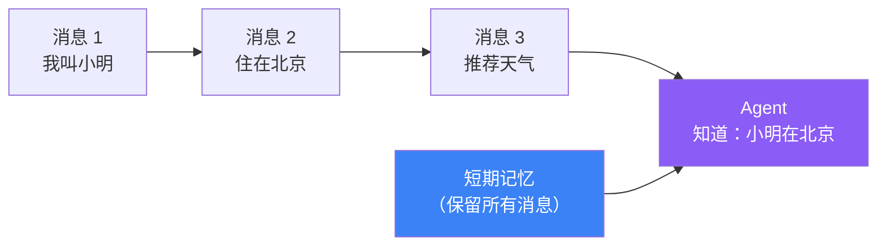
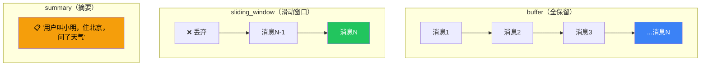

# 短期记忆

## 这是什么？

Agent 在**单次对话**中记住之前说过的话。就像你跟朋友聊天，记得上一句说了什么。



## 使用方式

```typescript
import { createAgent } from "langchain";

const agent = createAgent({
  model: "openai:gpt-4o",
  tools: [getWeather],
  memory: {
    type: "short_term",
    maxMessages: 20, // 保留最近 20 条消息
  },
});

// 第一次对话
await agent.invoke({
  messages: [{ role: "user", content: "我叫小明，住在北京" }],
});

// 第二次对话——Agent 记得你是谁
await agent.invoke({
  messages: [{ role: "user", content: "我住的地方天气怎么样？" }],
});
// Agent 知道"我住的地方"是北京
```

## 记忆策略

| 策略 | 说明 | 适用场景 |
|------|------|---------|
| `buffer` | 保留全部消息 | 短对话（<20 条） |
| `sliding_window` | 只保留最近 N 条 | 长对话（防止 Token 爆炸） |
| `summary` | 自动压缩成摘要 | 超长对话（客服场景） |

## 策略对比



## 配置示例

```typescript
// 策略 1：全保留（适合短对话）
memory: { type: "short_term", strategy: "buffer" }

// 策略 2：滑动窗口（适合长对话）
memory: { type: "short_term", strategy: "sliding_window", maxMessages: 10 }

// 策略 3：摘要压缩（适合超长对话）
memory: { type: "short_term", strategy: "summary", summaryEvery: 20 }
```

## 常见问题

| 问题 | 原因 | 解决方案 |
|------|------|---------|
| Token 超限 | 消息太多没裁剪 | 用 `sliding_window` 或 `summary` |
| 忘记前面内容 | 窗口太小 | 调大 `maxMessages` |
| 摘要丢失细节 | 压缩太激进 | 调整 `summaryEvery` 间隔 |

## 下一步

- [长期记忆](/langchain/long-term-memory) — 跨会话记忆
- [Deep Agents 记忆](/deepagents/memory)
