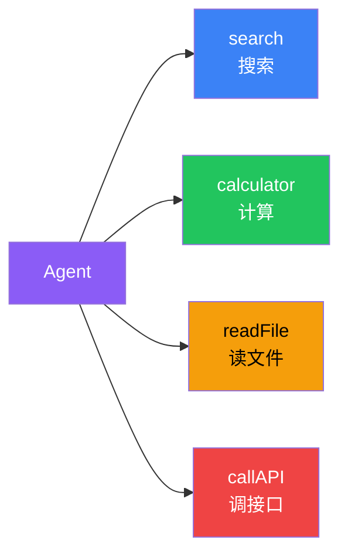

# Tools（工具）

## 这是什么？

工具 = Agent 能做的"事"。Agent 本身只能说话，要让它查天气、搜网页、操作数据库，就得给它配工具。

> 类比：Agent 是厨师，工具是厨具——刀、锅、烤箱，没有工具再好的厨艺也发挥不出来。



## 创建工具

```typescript
import { tool } from "langchain";
import { z } from "zod";

const myTool = tool(
  // 执行函数：工具实际干的事
  ({ input }) => `处理结果：${input}`,
  {
    name: "my_tool",
    description: "工具描述——Agent 靠这个决定要不要调用",
    schema: z.object({
      input: z.string().describe("输入参数"),
    }),
  }
);
```

## 同步 vs 异步

```typescript
// 同步工具
const calc = tool(
  ({ expression }) => String(eval(expression)),
  { name: "calc", description: "计算数学表达式", schema: z.object({ expression: z.string() }) }
);

// 异步工具
const fetchTool = tool(
  async ({ url }) => {
    const response = await fetch(url);
    return await response.text();
  },
  { name: "fetch_url", description: "获取网页内容", schema: z.object({ url: z.string() }) }
);
```

## 返回复杂数据

```typescript
const searchTool = tool(
  async ({ query }) => {
    const results = await search(query);
    // 返回 JSON 字符串
    return JSON.stringify(results.slice(0, 5));
  },
  {
    name: "search",
    description: "搜索并返回前 5 条结果",
    schema: z.object({ query: z.string() }),
  }
);
```

## ⚠️ 踩坑指南

| 问题 | 说明 |
|------|------|
| **描述要具体** | "查询指定城市天气" 比 "获取信息" 好 10 倍 |
| **参数要严格** | 用 zod 严格定义，别用 `any` |
| **错误要处理** | try/catch，别让 Agent 收到原始报错 |
| **返回值要干净** | Agent 要靠返回值回答用户，返回人类可读的文本 |

## 下一步

- [工具调用](/langchain/agents/tool-calling) — Agent 如何调用工具
- [MCP](/langchain/mcp) — 标准化工具协议
- [中间件](/langchain/middleware)
