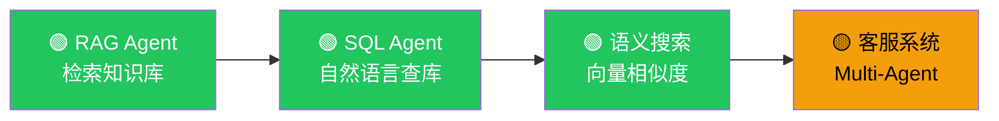

# LangChain 实战教程

## 怎么用这些教程？

每个教程都是一个**完整可运行的项目**，从零搭建到能跑。建议按顺序学，也可以挑感兴趣的直接看。



## 教程列表

| 教程 | 你会学到 | 难度 | 核心概念 |
|------|---------|------|---------|
| [构建 RAG Agent](/langchain/tutorials/rag-agent) | 从知识库中检索并回答问题 | ⭐⭐ | 向量搜索、文档切分、检索增强 |
| [构建 SQL Agent](/langchain/tutorials/sql-agent) | 用自然语言查询数据库 | ⭐⭐ | 工具定义、SQL 生成、安全校验 |
| [语义搜索引擎](/langchain/tutorials/semantic-search) | 基于向量的文档搜索 | ⭐⭐ | Embedding、相似度计算、向量库 |
| [客服系统](/langchain/tutorials/customer-support) | 多 Agent 协作处理不同问题 | ⭐⭐⭐ | Handoffs、路由、Multi-Agent |

## 前置准备

### 1. 安装依赖

```bash
npm install langchain @langchain/openai zod
```

### 2. 配置环境变量

```bash
# .env
OPENAI_API_KEY=sk-xxx
```

### 3. 验证环境

```typescript
import { createAgent, tool } from "langchain";
import { z } from "zod";

const hello = tool(() => "Hello!", {
  name: "hello",
  description: "打个招呼",
  schema: z.object({}),
});

const agent = createAgent({
  model: "openai:gpt-4o-mini",
  tools: [hello],
});

const result = await agent.invoke({
  messages: [{ role: "user", content: "打个招呼" }],
});
console.log(result);
```

看到输出就说明环境 OK，可以开始教程了。

## 学习路径建议

| 你是谁 | 推荐路线 |
|--------|---------|
| **后端开发者** | 语义搜索 → RAG Agent → SQL Agent → 客服系统 |
| **全栈开发者** | RAG Agent → 客服系统 → 看 [前端集成](/langchain/frontend) |
| **只想快速验证** | 先看 [Deep Agents](/deepagents/)，LangChain 慢慢学 |

## 下一步

- [构建 RAG Agent](/langchain/tutorials/rag-agent) — 最推荐的入门教程
- [创建 Agent](/langchain/agents/creation) — Agent 基础知识
