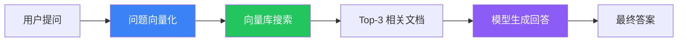

# 构建 RAG Agent

## 目标

构建一个 Agent，它能从你的文档中检索相关内容，然后基于内容回答问题。

## 完整代码

```typescript
import { createAgent } from "langchain";
import { OpenAIEmbeddings } from "@langchain/openai";
import { MemoryVectorStore } from "langchain/vectorstores/memory";
import { RecursiveCharacterTextSplitter } from "langchain/text_splitter";
import { Document } from "@langchain/core/documents";

// ① 准备文档
const documents = [
  new Document({
    pageContent: "LangChain 是一个用于构建 LLM 应用的开源框架...",
    metadata: { source: "docs/langchain.md" },
  }),
  new Document({
    pageContent: "Deep Agents 是开箱即用的 Agent 框架...",
    metadata: { source: "docs/deepagents.md" },
  }),
  new Document({
    pageContent: "LangGraph 是底层编排运行时...",
    metadata: { source: "docs/langgraph.md" },
  }),
];

// ② 切分文档
const splitter = new RecursiveCharacterTextSplitter({
  chunkSize: 500,
  chunkOverlap: 50,
});
const chunks = await splitter.splitDocuments(documents);

// ③ 向量化并存储
const embeddings = new OpenAIEmbeddings();
const vectorStore = await MemoryVectorStore.fromDocuments(chunks, embeddings);

// ④ 创建 RAG Agent
const agent = createAgent({
  model: "openai:gpt-4o",
  retrieval: {
    vectorStore,
    topK: 3,
  },
  system: `你是一个文档助手。根据检索到的资料回答问题。
如果资料中没有相关内容，就说"我不知道"。`,
});

// ⑤ 调用
const result = await agent.invoke({
  messages: [{ role: "user", content: "Deep Agents 是什么？" }],
});

console.log(result);
```

## 工作流程



## 扩展

- 换成真实的文档（PDF、Markdown 文件）
- 用持久化向量库（Chroma、Pinecone）
- 加入对话记忆，支持多轮问答

## 下一步

- [SQL Agent](/langchain/tutorials/sql-agent)
- [RAG 详解](/langchain/retrieval)
