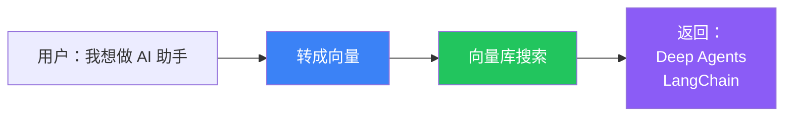

# 语义搜索引擎

## 目标

构建一个搜索引擎——不是关键词匹配，而是**理解意思**。搜"怎么减肥"，能找到"瘦身方法"。



## 实现

```typescript
import { OpenAIEmbeddings } from "@langchain/openai";
import { MemoryVectorStore } from "langchain/vectorstores/memory";
import { Document } from "@langchain/core/documents";

// ① 准备文档
const docs = [
  new Document({ pageContent: "LangChain 是一个 Agent 开发框架", metadata: { id: 1 } }),
  new Document({ pageContent: "Deep Agents 是开箱即用的 Agent 框架", metadata: { id: 2 } }),
  new Document({ pageContent: "LangGraph 是底层编排运行时", metadata: { id: 3 } }),
  new Document({ pageContent: "RAG 是检索增强生成技术", metadata: { id: 4 } }),
];

// ② 向量化
const embeddings = new OpenAIEmbeddings();
const vectorStore = await MemoryVectorStore.fromDocuments(docs, embeddings);

// ③ 搜索
const results = await vectorStore.similaritySearch("我想做一个 AI 助手", 2);

console.log(results);
// 返回最相关的 2 篇文档：
// 1. "Deep Agents 是开箱即用的 Agent 框架"
// 2. "LangChain 是一个 Agent 开发框架"
```

## 为什么比关键词搜索好？

| 关键词搜索 | 语义搜索 |
|-----------|---------|
| "AI 助手" 匹配不到 "Agent 框架" | 理解"AI 助手"≈"Agent 框架" |
| 要求用户猜关键词 | 用户说人话就行 |
| 漏掉同义词 | 自动理解语义 |

## 关键概念

| 概念 | 说明 |
|------|------|
| **Embedding（向量化）** | 把文字转成数字向量，捕捉语义 |
| **VectorStore（向量库）** | 存储和搜索向量的数据库 |
| **similaritySearch** | 找到与查询向量最相似的文档 |

## 下一步

- [RAG Agent](/langchain/tutorials/rag-agent) — 在搜索基础上加 Agent
- [RAG 详解](/langchain/retrieval) — RAG 完整流程
- [语义搜索进阶](/langchain/retrieval#向量库)
