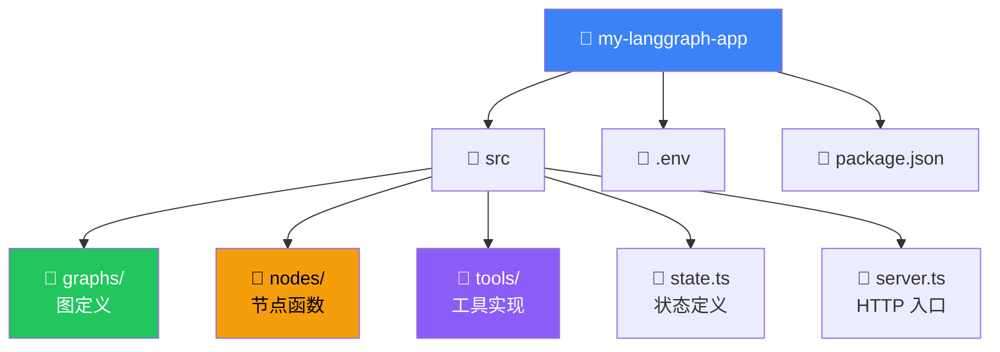

# 应用结构

## 这是什么？

应用结构 = 你的 LangGraph 项目该怎么组织文件和目录。好的结构让代码好维护、好协作、好测试。



## 推荐目录结构

```
my-langgraph-app/
├── src/
│   ├── graphs/
│   │   ├── chat.ts          # 对话 Agent 图
│   │   ├── research.ts      # 研究助手图
│   │   └── index.ts         # 导出所有图
│   ├── nodes/
│   │   ├── agent.ts         # Agent 节点（调用 LLM）
│   │   ├── search.ts        # 搜索节点
│   │   ├── analyze.ts       # 分析节点
│   │   └── summarize.ts     # 总结节点
│   ├── tools/
│   │   ├── web-search.ts    # 网页搜索工具
│   │   ├── calculator.ts    # 计算器工具
│   │   └── index.ts         # 导出所有工具
│   ├── state.ts             # 状态类型定义
│   ├── prompts.ts           # 提示词模板
│   ├── server.ts            # HTTP 服务入口
│   └── config.ts            # 配置管理
├── tests/
│   ├── nodes/               # 节点单元测试
│   └── graphs/              # 图集成测试
├── .env                     # 环境变量（不要提交）
├── .env.example             # 环境变量模板
├── package.json
├── tsconfig.json
└── Dockerfile
```

## 核心文件说明

### state.ts — 状态定义

```typescript
import { Annotation, MessagesAnnotation } from "@langchain/langgraph";

export const AgentState = Annotation.Root({
  ...MessagesAnnotation.spec,

  // 自定义字段
  researchResults: Annotation<string[]>({
    reducer: (x, y) => [...x, ...y],
    default: () => [],
  }),

  currentStep: Annotation<string>({
    reducer: (_, update) => update,
    default: () => "start",
  }),
});
```

### nodes/agent.ts — 节点定义

```typescript
import { ChatOpenAI } from "@langchain/openai";
import type { AgentState } from "../state";

const model = new ChatOpenAI({ model: "gpt-4o" });

export const agentNode = async (state: typeof AgentState.State) => {
  const response = await model.invoke(state.messages);
  return { messages: [response] };
};
```

### graphs/chat.ts — 图定义

```typescript
import { StateGraph, START, END } from "@langchain/langgraph";
import { AgentState } from "../state";
import { agentNode } from "../nodes/agent";
import { tools } from "../tools";
import { ToolNode } from "@langchain/langgraph/prebuilt";

const toolNode = new ToolNode(tools);

const shouldContinue = (state) => {
  const last = state.messages.at(-1);
  return last.tool_calls?.length ? "tools" : END;
};

export const chatGraph = new StateGraph(AgentState)
  .addNode("agent", agentNode)
  .addNode("tools", toolNode)
  .addEdge(START, "agent")
  .addConditionalEdges("agent", shouldContinue)
  .addEdge("tools", "agent")
  .compile();
```

### server.ts — HTTP 入口

```typescript
import express from "express";
import { chatGraph } from "./graphs/chat";

const app = express();
app.use(express.json());

app.post("/chat", async (req, res) => {
  const result = await chatGraph.invoke({
    messages: [{ role: "user", content: req.body.message }],
  });
  res.json({ reply: result.messages.at(-1)?.content });
});

app.listen(3000);
```

## 团队协作建议

| 建议 | 说明 |
|------|------|
| **每个图一个文件** | 职责清晰，好找代码 |
| **节点和图分离** | 节点可以复用、单独测试 |
| **状态统一管理** | 所有状态定义在 `state.ts` |
| **工具独立目录** | 工具是独立的，可以跨图复用 |
| **测试对应目录** | `tests/nodes/` 和 `tests/graphs/` |

## 常见问题

| 问题 | 解决方案 |
|------|----------|
| 文件太多找不到 | 按功能分目录，每个文件职责单一 |
| 状态定义重复 | 统一在 `state.ts`，其他文件 import |
| 节点互相依赖 | 用依赖注入，不要直接 import 其他节点 |
| 多图共享工具 | 工具放 `tools/`，图里 import 使用 |

## 下一步

- [本地服务器](/langgraph/local-server) — 启动本地开发
- [部署](/langgraph/deployment) — 部署到生产环境
- [Subgraphs（子图）](/langgraph/subgraphs) — 模块化组织图
