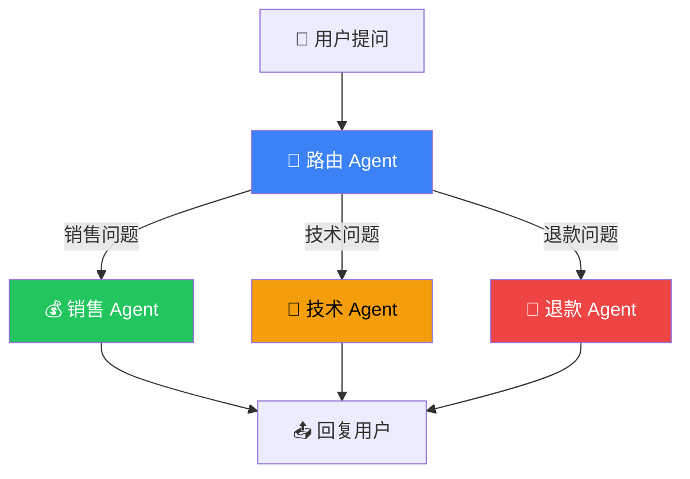
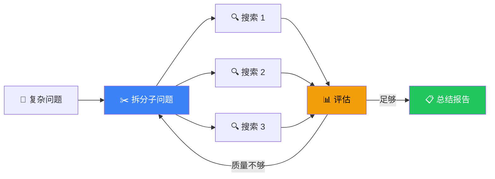

# 案例研究

## 案例 1：多 Agent 客服系统

### 场景

用户提问 → 路由 Agent 判断类型 → 分发给销售/技术/退款 Agent → 汇总回复



### LangGraph 价值

- **条件边**实现智能路由——根据用户意图自动分发
- **持久化**支持跨会话记忆——用户上次的问题能记住
- **子图**让每个 Agent 独立开发和测试

### 关键代码片段

```typescript
const graph = new StateGraph(StateAnnotation)
  .addNode("router", routerNode)
  .addNode("sales", salesAgent)
  .addNode("tech", techAgent)
  .addNode("refund", refundAgent)
  .addEdge(START, "router")
  .addConditionalEdges("router", (state) => state.category);
```

---

## 案例 2：研究助手

### 场景

拆分复杂问题 → 并行搜索多个来源 → 评估质量 → 汇总 → 生成报告



### LangGraph 价值

- **子图**实现模块化——搜索逻辑封装成可复用子图
- **循环**支持多次搜索迭代——质量不够就换个词再搜
- **并行执行**提升效率——多个搜索同时跑

---

## 案例 3：代码审查 Agent

### 场景

读代码 → 静态分析 → 跑测试 → 生成审查报告 → 等人工确认 → 应用修改

### LangGraph 价值

- **人工介入**在关键修改前暂停确认
- **时间旅行**回溯审查过程，看看 Agent 为什么做这个判断
- **持久化执行**保证长时间审查不会丢失进度

### 关键设计

```typescript
const graph = new StateGraph(/* ... */)
  .addNode("analyze", analyzeNode)
  .addNode("test", runTestNode)
  .addNode("review", reviewNode)
  .addNode("apply", applyChangesNode)
  // 分析完后自动跑测试
  .addEdge("analyze", "test")
  // 测试完生成报告
  .addEdge("test", "review")
  // 审查后等人工确认
  .addEdge("review", "apply", { interrupt: true })
  .addEdge("apply", END);
```

---

## 案例 4：数据处理管道

### 场景

下载数据 → 清洗 → 分析 → 生成可视化 → 发送报告

### LangGraph 价值

- **持久化执行**保证中断后可恢复——下载到一半断网了，不用从头来
- **检查点**避免重复计算——已经清洗过的数据不用再洗一遍
- **流式输出**实时展示进度——用户能看到每一步的状态

---

## 案例 5：内容创作 Agent

### 场景

确定主题 → 收集素材 → 写大纲 → 写初稿 → 人工修改 → 发布

### LangGraph 价值

- **条件边**根据内容类型选择不同写作风格
- **人工介入**在发布前等作者确认
- **循环**支持多轮修改——不满意就重写

---

## 案例总结

| 案例 | 核心 LangGraph 能力 |
|------|---------------------|
| 客服系统 | 条件边、子图、持久化 |
| 研究助手 | 子图、循环、并行执行 |
| 代码审查 | 人工介入、时间旅行 |
| 数据管道 | 持久化执行、检查点 |
| 内容创作 | 条件边、人工介入、循环 |

## 下一步

- [实战教程](/langgraph/tutorials/) — 自己动手做一个
- [工作流 vs Agent](/langgraph/workflows-agents) — 理解两种模式
- [Graph API](/langgraph/graph-api) — 学习核心 API
