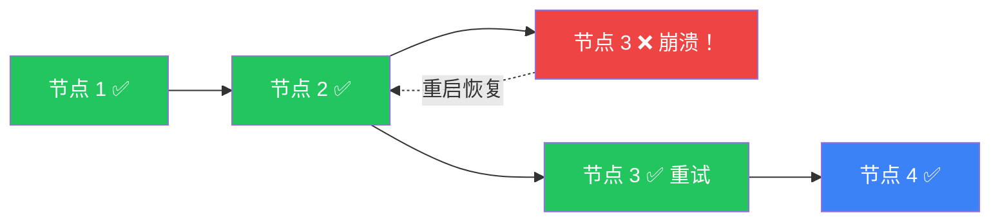

# 持久化执行（Durable Execution）

## 这是什么？

持久化执行 = **整个执行过程都可恢复**。不只是"存档"，而是每一步都记录，挂了、重启了、换机器了，都能从断点继续。



## 普通执行 vs 持久化执行

| 普通执行 | 持久化执行 |
|---------|-----------|
| 游戏玩到一半停电，进度全丢 | 游戏自动存档，来电后继续 |
| 程序崩了，从头再来 | 程序崩了，从上次存档继续 |
| 服务器重启，任务丢失 | 服务器重启，任务自动恢复 |
| 换机器，数据丢失 | 换机器，从数据库恢复 |

## 工作原理

```
节点 1 执行 → 自动存档 → 节点 2 执行 → 自动存档 → 节点 3 执行（挂了！）
                                                        ↓
重启 → 加载节点 2 的存档 → 从节点 3 继续执行 → 存档 → 完成
```

## 配置

```typescript
import { StateGraph, Annotation, START, END } from "@langchain/langgraph";
import { PostgresSaver } from "@langchain/langgraph/checkpoint/postgres";

const StateAnnotation = Annotation.Root({
  messages: Annotation<any[]>({
    reducer: (x, y) => x.concat(y),
    default: () => [],
  }),
  step: Annotation<number>({ default: () => 0, reducer: (_, u) => u }),
});

const graph = new StateGraph(StateAnnotation)
  .addNode("process", async (state) => {
    // 模拟长时间任务
    await doHeavyWork(state.step);
    return { step: state.step + 1 };
  })
  .addEdge(START, "process")
  .addEdge("process", END)
  .compile();

// 使用 PostgreSQL 存检查点（生产环境）
const checkpointer = new PostgresSaver({
  connectionString: process.env.DATABASE_URL,
});

const app = graph.compile({ checkpointer });

// 执行——即使中途崩溃，重启后也会从最近的检查点继续
const result = await app.invoke(
  { messages: [], step: 0 },
  { configurable: { thread_id: "job-123" } }
);
```

## 存储后端选择

| 后端 | 适用场景 | 持久性 |
|------|----------|--------|
| `MemorySaver` | 开发测试 | ❌ 进程重启丢失 |
| `SqliteSaver` | 本地应用 | ✅ 文件持久化 |
| `PostgresSaver` | 生产环境 | ✅ 数据库持久化 |

## 与普通持久化的区别

```typescript
// 普通持久化：只存最终状态
const result = await graph.invoke(input);
await db.save(result);  // 只存了结果

// 持久化执行：每一步都存
// LangGraph 自动在每个节点执行后存检查点
// 崩溃时可以恢复到最近的检查点
const app = graph.compile({ checkpointer });
const result = await app.invoke(input);
// 检查点自动管理，不需要手动 save
```

## 适用场景

| 场景 | 说明 |
|------|------|
| 长时间数据处理 | 管道跑几个小时，中间崩溃能恢复 |
| 人工审批流程 | 审批可能等几天，中间服务重启不影响 |
| 高可用 Agent | 服务器故障自动恢复 |
| 批量任务 | 处理几千条数据，中断了从断点继续 |

## 最佳实践

| 建议 | 说明 |
|------|------|
| **生产用 PostgreSQL** | 内存存储重启就丢了 |
| **设置合理的 thread_id** | 方便查找和恢复 |
| **定期清理旧检查点** | 数据库空间有限 |
| **监控检查点大小** | 状态太大影响性能 |

## 下一步

- [持久化](/langgraph/persistence) — 基础持久化
- [时间旅行](/langgraph/time-travel) — 回溯历史
- [部署](/langgraph/deployment) — 部署到生产
