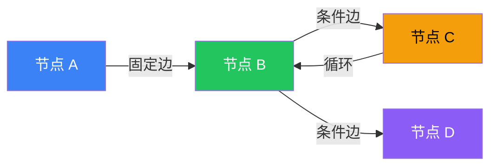
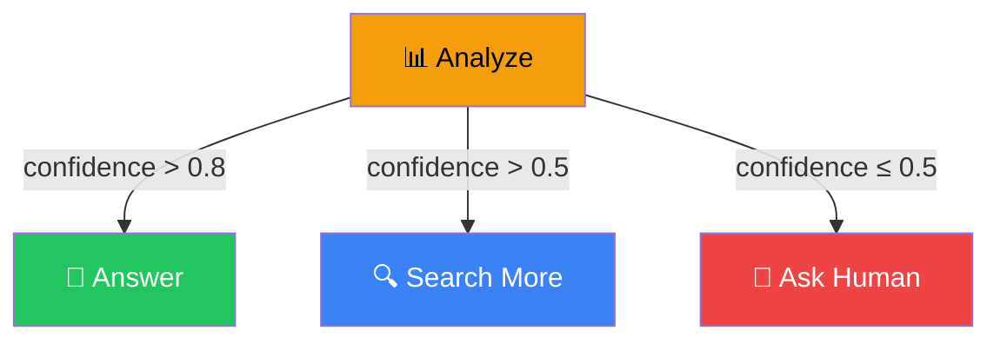
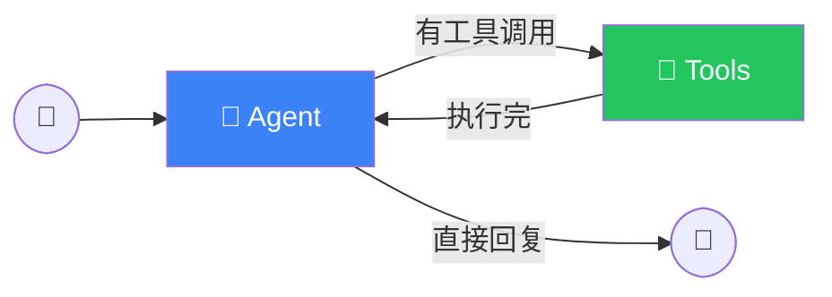

# Edges（边）

## 这是什么？

边 = 节点之间的连接线，决定了**下一个执行谁**。



## 两种边

| 类型 | 说明 | 类比 | 用法 |
|------|------|------|------|
| **固定边** | A 干完一定去 B | 流水线，固定顺序 | `addEdge()` |
| **条件边** | 根据结果决定去 B 还是 C | 岔路口，看路标走 | `addConditionalEdges()` |

## 固定边

最简单的连接——A 完成后一定去 B：

```typescript
import { StateGraph } from "@langchain/langgraph";

const graph = new StateGraph(StateAnnotation)
  .addNode("research", researchNode)
  .addNode("analyze", analyzeNode)
  .addNode("write", writeNode)

  // 固定边：定义执行顺序
  .addEdge("__start__", "research")     // 图的起点 → research
  .addEdge("research", "analyze")       // research → analyze
  .addEdge("analyze", "write")          // analyze → write
  .addEdge("write", "__end__")          // write → 图的终点

  .compile();
```


### 特殊节点

| 节点 | 说明 |
|------|------|
| `__start__` | 图的入口点，执行的第一个节点之前 |
| `__end__` | 图的出口点，执行结束 |

## 条件边

根据状态动态决定走哪条路：

```typescript
graph
  .addNode("analyze", analyzeNode)
  .addNode("answer", answerNode)
  .addNode("search", searchNode)
  .addNode("ask_human", askHumanNode)

  // 条件边：从 analyze 出发，根据 confidence 决定去哪
  .addConditionalEdges(
    "analyze",          // 从哪个节点出发
    (state) => {        // 决策函数：读取状态，返回下一步的节点名
      if (state.confidence > 0.8) return "answer";
      if (state.confidence > 0.5) return "search";
      return "ask_human";
    }
  );
```



### 决策函数

```typescript
// 决策函数接收当前状态，返回下一个节点的名称
const router = (state) => {
  const lastMessage = state.messages.at(-1);

  // 根据消息类型路由
  if (lastMessage.tool_calls?.length > 0) {
    return "tools";          // 需要调用工具
  }
  return "__end__";          // 直接回复，结束
};

graph.addConditionalEdges("agent", router);
```

### 路由表

也可以用 Map 定义路由表，更清晰：

```typescript
graph.addConditionalEdges(
  "classifier",
  (state) => state.category,
  {
    // category 值 → 目标节点
    "technical": "tech_support",
    "billing": "billing_handler",
    "general": "general_chat",
  }
);
```

## 循环

边可以形成循环——节点执行完后回到之前的节点：

```typescript
graph
  .addNode("agent", agentNode)
  .addNode("tools", toolNode)

  .addEdge("__start__", "agent")

  // 条件边：Agent 调用工具 → 去执行工具
  .addConditionalEdges("agent", (state) => {
    if (state.messages.at(-1).tool_calls?.length > 0) {
      return "tools";    // 有工具调用 → 去 tools 节点
    }
    return "__end__";    // 没有工具调用 → 结束
  })

  // 固定边：工具执行完 → 回到 Agent（形成循环！）
  .addEdge("tools", "agent");
```



> 💡 这就是经典的 **Agent 循环**：Agent 思考 → 调用工具 → 拿到结果 → 再思考 → 直到不需要工具为止。

### 防止无限循环

```typescript
const graph = new StateGraph(StateAnnotation)
  .addNode("agent", agentNode)
  .addNode("tools", toolNode)
  // ... 边的定义 ...
  .compile({
    // 设置最大步数，防止无限循环
    recursionLimit: 10,  // 最多执行 10 步
  });
```

## 实战：完整的 Agent 图

```typescript
import { StateGraph, Annotation, MessagesAnnotation } from "@langchain/langgraph";
import { ToolNode } from "@langchain/langgraph/prebuilt";
import { ChatOpenAI } from "@langchain/openai";

// 状态
const AgentState = Annotation.Root({
  ...MessagesAnnotation.spec,
});

// 模型和工具
const model = new ChatOpenAI({ model: "gpt-4o" }).bindTools(tools);
const toolNode = new ToolNode(tools);

// Agent 节点
const agentNode = async (state) => {
  const response = await model.invoke(state.messages);
  return { messages: [response] };
};

// 路由函数
const shouldContinue = (state) => {
  const lastMessage = state.messages.at(-1);
  if (lastMessage.tool_calls?.length > 0) {
    return "tools";
  }
  return "__end__";
};

// 构建图
const graph = new StateGraph(AgentState)
  .addNode("agent", agentNode)
  .addNode("tools", toolNode)
  .addEdge("__start__", "agent")
  .addConditionalEdges("agent", shouldContinue)
  .addEdge("tools", "agent")      // 循环：工具 → Agent
  .compile();

// 执行
const result = await graph.invoke({
  messages: [{ role: "user", content: "北京天气怎么样？" }],
});
```

## 常见模式

| 模式 | 说明 | 示例 |
|------|------|------|
| **顺序流水线** | A → B → C | 研究 → 分析 → 写作 |
| **条件分支** | A → (B or C) | 分类 → (技术 or 账单) |
| **Agent 循环** | Agent ↔ Tools | 思考 → 执行 → 思考 |
| **并行合并** | A → (B ∥ C) → D | 搜索 → (搜Google ∥ 搜Bing) → 合并 |
| **人工介入** | A → Human → B | 生成 → 等待人工审批 → 发布 |

## 最佳实践

1. **固定边优先**——能用固定边就不用条件边，更可预测
2. **条件函数要简单**——别在路由函数里做复杂计算
3. **防止无限循环**——设置 `recursionLimit`
4. **每条边都有意义**——画出流程图再写代码
5. **测试边界情况**——条件不满足时会发生什么

## 下一步

- [Interrupts（中断）](/langgraph/interrupts) — 人工介入
- [Subgraphs（子图）](/langgraph/subgraphs) — 嵌套图
- [Persistence（持久化）](/langgraph/persistence) — 状态持久化
