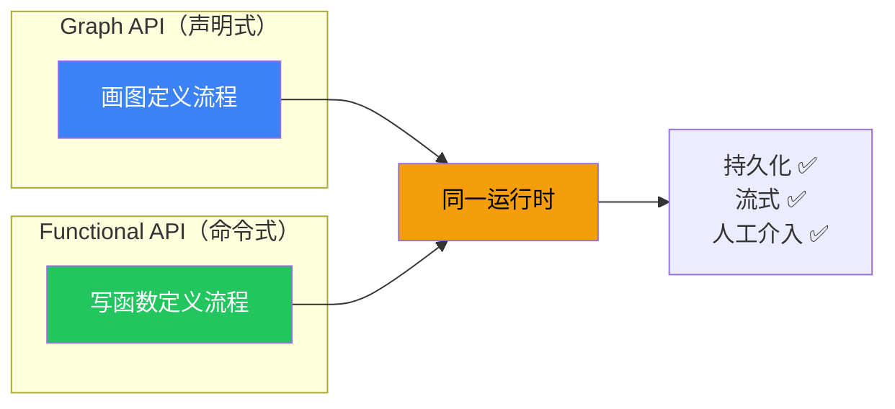

# Functional API

## 这是什么？

Functional API = 用普通函数的方式定义工作流，不用画图。

## 类比

> Graph API = 画流程图
> Functional API = 写菜谱（第一步做什么，第二步做什么）

## 核心概念

| 概念 | 说明 |
|------|------|
| `task` | 一个独立的任务函数 |
| `entrypoint` | 工作流的入口点 |

## 示例

```typescript
import { entrypoint, task } from "@langchain/langgraph";
import { ChatOpenAI } from "@langchain/openai";

const model = new ChatOpenAI({ model: "gpt-4o" });

// ① 定义任务
const search = task("search", async (query: string) => {
  // 模拟搜索
  return `搜索"${query}"的结果：LangChain 是一个 Agent 框架...`;
});

const summarize = task("summarize", async (content: string) => {
  const response = await model.invoke(`用一句话总结：${content}`);
  return response.content as string;
});

// ② 定义工作流入口
const research = entrypoint("research", async (topic: string) => {
  const results = await search(topic);
  const summary = await summarize(results);
  return { topic, results, summary };
});

// ③ 执行
const result = await research.invoke("LangChain");
console.log(result.summary);
```

## 与 Graph API 的关系



两种 API 共享同一个运行时，功能完全一致，只是写法不同。

## 持久化支持

```typescript
const research = entrypoint("research", async (topic: string) => {
  const results = await search(topic);
  const summary = await summarize(results);
  return summary;
});
```

中间结果自动保存，崩溃后可以从断点恢复。

## 人工介入

```typescript
import { interrupt } from "@langchain/langgraph";

const sendEmail = task("send_email", async (email: string) => {
  const decision = interrupt({ question: `确认发送到 ${email}？` });
  if (decision.approved) {
    await doSend(email);
    return "已发送";
  }
  return "已取消";
});
```

## 下一步

- [Graph API](/langgraph/graph-api)
- [两种 API 怎么选](/langgraph/api-choice)
