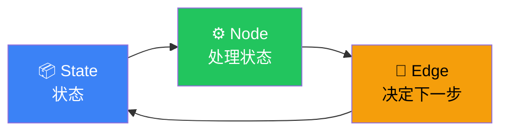

# Graph API

## 核心概念



三者的关系：State 存数据，Node 处理数据，Edge 决定下一步走哪个 Node。

## 基本结构

```typescript
import { StateGraph, START, END } from "@langchain/langgraph";

// ① 定义状态通道
const graph = new StateGraph({
  channels: {
    messages: { value: (x, y) => x.concat(y), default: () => [] },
    step: { value: (x, y) => y, default: () => 0 },
  },
});

// ② 添加节点
graph.addNode("process", async (state) => {
  return {
    messages: [{ role: "assistant", content: `处理第 ${state.step + 1} 步` }],
    step: state.step + 1,
  };
});

// ③ 定义边
graph.addEdge(START, "process");
graph.addEdge("process", END);

// ④ 编译执行
const app = graph.compile();
const result = await app.invoke({ messages: [], step: 0 });
```

## 条件边

```typescript
graph.addConditionalEdges(
  "analyze",  // 从哪个节点出发
  (state) => {  // 决策函数
    if (state.confidence > 0.8) return "answer";
    if (state.confidence > 0.5) return "search_more";
    return "ask_human";
  }
);
```

## 下一步

- [State（状态）](/langgraph/state)
- [Nodes（节点）](/langgraph/nodes)
- [Edges（边）](/langgraph/edges)
