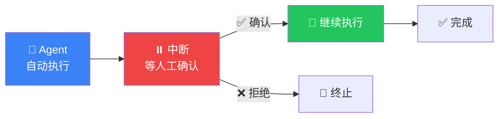

# 人工介入（Human-in-the-Loop）

## 这是什么？

人工介入 = 在 Agent 执行过程中**插入人类的判断**。Agent 做到关键步骤时暂停，等你看一眼、确认没问题后再继续。



## 为什么需要？

| 场景 | 没有 HITL | 有 HITL |
|------|-----------|---------|
| 发邮件 | Agent 直接发了，可能发错人 | 暂停确认收件人 |
| 转账 | Agent 自己转了，金额可能错 | 暂停确认金额和收款人 |
| 代码部署 | Agent 直接部署了 | 暂停等 code review |
| 删除数据 | Agent 把数据删了 | 暂停确认要删什么 |

## 核心 API

### `interrupt()` — 在节点中暂停

```typescript
import { interrupt } from "@langchain/langgraph";

const dangerousNode = async (state) => {
  // 暂停执行，传入需要展示给用户的信息
  const decision = interrupt({
    question: "确认执行这个操作？",
    preview: state.pendingAction,
    risk: "high",
  });

  // 用户确认后，decision 就是用户传回的值
  if (decision.approved) {
    await executeAction(state.pendingAction);
    return { status: "executed" };
  } else {
    return { status: "cancelled" };
  }
};
```

### `resume` — 恢复执行

```typescript
// 第一次执行——会在 interrupt 处暂停
const result1 = await app.invoke(
  { messages: [{ role: "user", content: "删除所有日志" }] },
  { configurable: { thread_id: "task-1" } }
);

// 用户看了 interrupt 的信息后，决定确认
const result2 = await app.invoke(
  null,  // 不需要新输入
  {
    configurable: { thread_id: "task-1" },
    resume: { approved: true },  // 传回用户的决定
  }
);
```

## 完整示例：审批流程

```typescript
import { StateGraph, Annotation, START, END, interrupt } from "@langchain/langgraph";
import { MemorySaver } from "@langchain/langgraph";
import { ChatOpenAI } from "@langchain/openai";

const model = new ChatOpenAI({ model: "gpt-4o" });

// 状态
const ApprovalState = Annotation.Root({
  task: Annotation<string>,
  plan: Annotation<string>({ default: () => "" }),
  approved: Annotation<boolean>({ default: () => false }),
  result: Annotation<string>({ default: () => "" }),
});

// 节点 1：制定计划
const planNode = async (state) => {
  const response = await model.invoke(`为以下任务制定执行计划：${state.task}`);
  return { plan: response.content as string };
};

// 节点 2：等人工审批
const approvalNode = async (state) => {
  const decision = interrupt({
    question: "请审批以下执行计划",
    task: state.task,
    plan: state.plan,
    riskLevel: "medium",
  });

  return { approved: decision.approved };
};

// 节点 3：执行
const executeNode = async (state) => {
  const response = await model.invoke(`执行以下计划：${state.plan}`);
  return { result: response.content as string };
};

// 构建图
const graph = new StateGraph(ApprovalState)
  .addNode("plan", planNode)
  .addNode("approval", approvalNode)
  .addNode("execute", executeNode)
  .addEdge(START, "plan")
  .addEdge("plan", "approval")
  .addConditionalEdges("approval", (state) =>
    state.approved ? "execute" : END
  )
  .addEdge("execute", END)
  .compile();

// 使用
const checkpointer = new MemorySaver();
const app = graph.compile({ checkpointer });

// ① 制定计划，暂停等审批
const r1 = await app.invoke(
  { task: "清理生产环境旧日志" },
  { configurable: { thread_id: "approval-1" } }
);

// ② 审批后继续
const r2 = await app.invoke(null, {
  configurable: { thread_id: "approval-1" },
  resume: { approved: true, reviewer: "admin", comment: "同意执行" },
});
```

## 与 Interrupts 的关系

| 概念 | 说明 |
|------|------|
| **Interrupts** | 底层机制——暂停执行 |
| **Human-in-the-Loop** | 设计模式——利用 Interrupts 实现人工介入 |

## 最佳实践

| 建议 | 说明 |
|------|------|
| **给足够的上下文** | interrupt 时传入足够的信息，让用户能做判断 |
| **区分风险等级** | 不是所有操作都需要人工介入 |
| **设置超时** | 防止永远等不到人工确认 |
| **记录审批日志** | 谁在什么时候做了什么决定 |

## 下一步

- [Interrupts](/langgraph/interrupts) — 中断机制详解
- [持久化](/langgraph/persistence) — 保存执行状态
- [Studio 调试](/langgraph/studio) — 可视化调试
