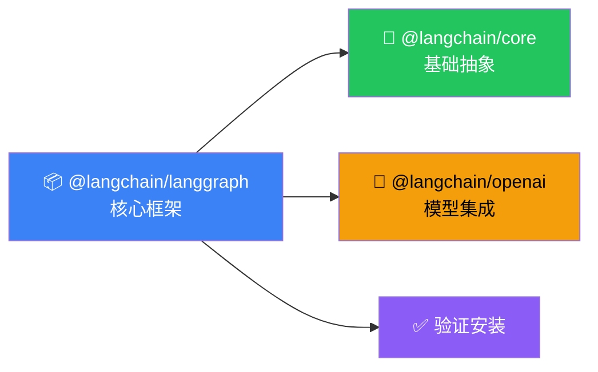

# 安装

## 这是什么？

LangGraph 是一个 TypeScript/Python 框架，让你用"画流程图"的方式构建 AI Agent。安装它就像装一个 npm 包一样简单。



## 环境要求

| 项目 | 要求 |
|------|------|
| Node.js | ≥ 18.x |
| TypeScript | ≥ 5.0（推荐） |
| 包管理器 | npm / pnpm / yarn |

## 安装步骤

### 1. 安装核心包

```bash
# npm
npm install @langchain/langgraph @langchain/core

# pnpm
pnpm add @langchain/langgraph @langchain/core

# yarn
yarn add @langchain/langgraph @langchain/core
```

### 2. 安装模型集成（按需）

根据你用的 LLM 选择对应的包：

```bash
npm install @langchain/openai        # OpenAI（GPT-4o 等）
npm install @langchain/anthropic     # Anthropic（Claude）
npm install @langchain/google-genai  # Google（Gemini）
npm install @langchain/ollama        # Ollama（本地模型）
```

### 3. 可选依赖

```bash
npm install zod                       # 工具参数校验
npm install @langchain/langgraph/checkpoint/postgres  # PostgreSQL 持久化
npm install @langchain/langgraph/checkpoint/sqlite    # SQLite 持久化
```

## 验证安装

创建一个最简图，确认一切正常：

```typescript
import { StateGraph, START, END, Annotation } from "@langchain/langgraph";

// 定义状态
const StateAnnotation = Annotation.Root({
  count: Annotation<number>({
    reducer: (_, update) => update,
    default: () => 0,
  }),
});

// 构建图
const graph = new StateGraph(StateAnnotation)
  .addNode("increment", (state) => ({ count: state.count + 1 }))
  .addEdge(START, "increment")
  .addEdge("increment", END)
  .compile();

// 执行
const result = await graph.invoke({ count: 0 });
console.log(result.count); // 1 ✅
console.log("LangGraph 安装成功！");
```

## 配置 API Key

```bash
# .env 文件
OPENAI_API_KEY=sk-xxx
# 或其他模型的 key
ANTHROPIC_API_KEY=sk-ant-xxx
```

使用 dotenv 加载：

```typescript
import "dotenv/config";
```

## 项目模板

```bash
# 推荐的 TypeScript 配置
npx tsc --init --target ES2022 --module NodeNext --moduleResolution NodeNext
```

## 常见安装问题

| 问题 | 原因 | 解决方案 |
|------|------|----------|
| `Cannot find module '@langchain/langgraph'` | 包没装上 | 重新 `npm install` |
| TypeScript 类型报错 | 版本太低 | 升级到 TS ≥ 5.0 |
| `fetch is not defined` | Node.js 版本太低 | 升级到 Node ≥ 18 |
| ESM/CJS 冲突 | 模块格式不匹配 | 在 `tsconfig.json` 中设置 `"module": "NodeNext"` |

## 下一步

- [快速开始](/langgraph/quickstart) — 几分钟内创建你的第一个 Agent
- [思维方式](/langgraph/thinking) — 理解 LangGraph 的设计哲学
- [本地服务器](/langgraph/local-server) — 启动本地开发服务
