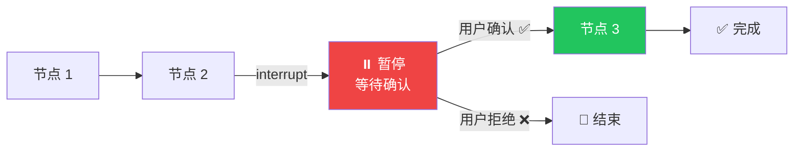

# Interrupts（中断）

## 这是什么？

中断 = 在图的某个节点**暂停执行**，等用户确认后再继续。就像游戏里的"暂停"键——你可以检查当前状态，确认没问题后按"继续"。



## 核心概念

| 概念 | 说明 |
|------|------|
| **interrupt** | 在节点执行前暂停 |
| **resume** | 用户确认后恢复执行 |
| **检查点** | 暂停时自动保存状态 |

## 基本用法

```typescript
import { StateGraph, Annotation, START, END, interrupt } from "@langchain/langgraph";

// 定义状态
const StateAnnotation = Annotation.Root({
  messages: Annotation<any[]>({
    reducer: (x, y) => x.concat(y),
    default: () => [],
  }),
  email: Annotation<{ to: string; subject: string; body: string }>({
    reducer: (_, update) => update,
  }),
  approved: Annotation<boolean>({
    reducer: (_, update) => update,
    default: () => false,
  }),
});

// 节点：准备邮件
const prepareEmail = async (state) => {
  return {
    email: {
      to: "user@example.com",
      subject: "报告已生成",
      body: "您的报告已准备就绪...",
    },
  };
};

// 节点：发送邮件（需要确认）
const sendEmail = async (state) => {
  // ① 暂停，等待人工确认
  const decision = interrupt({
    question: `确认发送邮件到 ${state.email.to}？`,
    preview: state.email,
  });

  // ② 用户确认后继续
  if (decision.approved) {
    await actuallySendEmail(state.email);
    return {
      messages: [{ role: "assistant", content: "邮件已发送 ✅" }],
      approved: true,
    };
  } else {
    return {
      messages: [{ role: "assistant", content: "邮件已取消 ❌" }],
      approved: false,
    };
  }
};

// 构建图
const graph = new StateGraph(StateAnnotation)
  .addNode("prepare", prepareEmail)
  .addNode("send", sendEmail)
  .addEdge(START, "prepare")
  .addEdge("prepare", "send")
  .addEdge("send", END)
  .compile();
```

## 执行和恢复

```typescript
import { MemorySaver } from "@langchain/langgraph";

const checkpointer = new MemorySaver();
const app = graph.compile({ checkpointer });

// ① 第一次执行——会停在 send 节点
const result1 = await app.invoke(
  { messages: [{ role: "user", content: "发送周报" }] },
  { configurable: { thread_id: "task-1" } }
);

console.log(result1.messages.at(-1)); // 邮件准备好了，等待确认

// ② 用户确认后恢复
const result2 = await app.invoke(
  null,  // 不需要新输入
  {
    configurable: { thread_id: "task-1" },
    resume: { approved: true },  // 传入用户的决定
  }
);

console.log(result2.messages.at(-1)); // 邮件已发送 ✅
```

## 适用场景

| 场景 | 说明 |
|------|------|
| 📧 **发邮件/消息前** | 确认收件人和内容 |
| 💳 **金融操作** | 转账、支付前确认金额 |
| 🗑️ **删除操作** | 防止误删重要数据 |
| 🔧 **配置变更** | 修改系统配置前确认 |
| 🤖 **Agent 自主操作** | Agent 想执行危险操作时暂停 |

## 常见问题

| 问题 | 解决方案 |
|------|----------|
| interrupt 不生效 | 确认编译时传入了 `checkpointer` |
| 恢复后状态丢失 | 确认用同一个 `thread_id` |
| 想取消中断 | 用 `resume: { approved: false }` |

## 下一步

- [人工介入](/langgraph/human-in-the-loop) — 完整的人工介入指南
- [持久化](/langgraph/persistence) — 保存执行状态
- [时间旅行](/langgraph/time-travel) — 回溯历史
