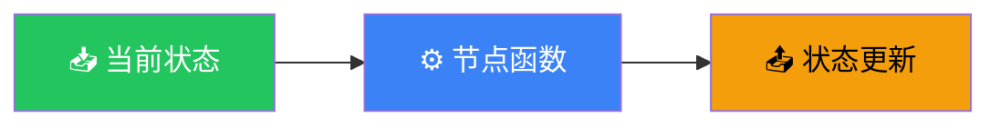
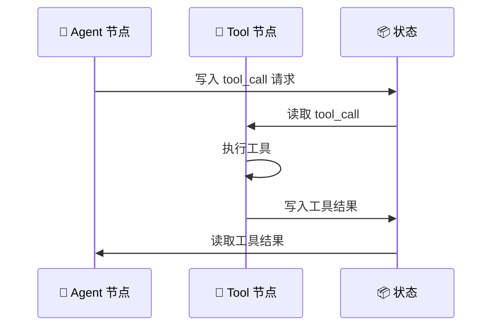

# Nodes（节点）

## 这是什么？

节点 = 一个处理状态的函数。输入是当前状态，输出是状态更新。



> 节点 = 流水线上的一个工位。原料（状态）进来，加工一下（处理），产出新东西（状态更新），传给下一个工位。

## 定义节点

```typescript
import { StateGraph, Annotation } from "@langchain/langgraph";

// 定义状态
const StateAnnotation = Annotation.Root({
  messages: Annotation<any[]>({
    reducer: (existing, update) => existing.concat(update),
    default: () => [],
  }),
  analysis: Annotation<string>({
    reducer: (existing, update) => update,
    default: () => "",
  }),
});

// 节点就是一个 async 函数
const analyzeNode = async (state) => {
  // ① 读取状态
  const lastMessage = state.messages.at(-1)?.content;

  // ② 做处理（调用 LLM、查数据库、调 API 等）
  const analysis = await llm.invoke(`分析这段话的核心要点：${lastMessage}`);

  // ③ 返回状态更新
  return {
    analysis: analysis.content,    // 覆盖 analysis 字段
    messages: [{ role: "assistant", content: "分析完成。" }],  // 追加消息
  };
};

// 添加到图中
const graph = new StateGraph(StateAnnotation)
  .addNode("analyze", analyzeNode);
```

## 节点类型

### 普通节点

最基本的节点——一个处理状态的函数：

```typescript
graph.addNode("summarize", async (state) => {
  const text = state.messages.map(m => m.content).join("\n");
  const summary = await llm.invoke(`总结：${text}`);
  return { summary: summary.content };
});
```

### 工具节点

自动执行 Agent 调用的工具：

```typescript
import { ToolNode } from "@langchain/langgraph/prebuilt";

const tools = [getWeather, searchWeb, calculator];
const toolNode = new ToolNode(tools);

graph.addNode("tools", toolNode);

// Agent 调用工具后，自动路由到 toolNode
// toolNode 会执行 tool_call 并把结果写入状态
```



### 子图节点

把另一个图作为节点嵌入：

```typescript
// 子图：搜索工作流
const searchGraph = new StateGraph(SearchState)
  .addNode("search", searchNode)
  .addNode("filter", filterNode)
  .addEdge("search", "filter")
  .compile();

// 主图：把子图作为节点
const mainGraph = new StateGraph(MainState)
  .addNode("research", searchGraph)  // 嵌入子图
  .addNode("write", writeNode)
  .addEdge("research", "write")
  .compile();
```

### LLM 节点

直接调用模型的节点：

```typescript
import { ChatOpenAI } from "@langchain/openai";

const model = new ChatOpenAI({ model: "gpt-4o" });

graph.addNode("chat", async (state) => {
  const response = await model.invoke(state.messages);
  return {
    messages: [response],
  };
});
```

## 多节点协作

```typescript
import { StateGraph, Annotation } from "@langchain/langgraph";

const StateAnnotation = Annotation.Root({
  messages: Annotation<any[]>({
    reducer: (existing, update) => existing.concat(update),
    default: () => [],
  }),
  research: Annotation<string>({ default: () => "" }),
  outline: Annotation<string>({ default: () => "" }),
  draft: Annotation<string>({ default: () => "" }),
});

// 节点 1：研究
const researchNode = async (state) => {
  const topic = state.messages.at(-1)?.content;
  const results = await searchWeb(topic);
  return { research: results };
};

// 节点 2：生成大纲
const outlineNode = async (state) => {
  const outline = await llm.invoke(`基于以下资料生成大纲：\n${state.research}`);
  return { outline: outline.content };
};

// 节点 3：撰写
const draftNode = async (state) => {
  const draft = await llm.invoke(`根据大纲写文章：\n${state.outline}`);
  return {
    draft: draft.content,
    messages: [{ role: "assistant", content: "文章已完成！" }],
  };
};

// 构建图
const graph = new StateGraph(StateAnnotation)
  .addNode("research", researchNode)
  .addNode("outline", outlineNode)
  .addNode("draft", draftNode)
  .addEdge("__start__", "research")
  .addEdge("research", "outline")
  .addEdge("outline", "draft")
  .addEdge("draft", "__end__")
  .compile();
```


## 节点最佳实践

| 原则 | 说明 | ❌ 不要 | ✅ 要 |
|------|------|---------|-------|
| **保持纯净** | 同样的输入，同样的输出 | 在节点里发邮件 | 用工具处理副作用 |
| **单一职责** | 一个节点做一件事 | 同时搜索和分析 | 拆成两个节点 |
| **返回 partial** | 只返回需要更新的字段 | 返回完整状态 | 返回 `{ key: value }` |
| **错误处理** | 失败要有 fallback | 直接抛异常 | try/catch + 友好的错误 |

## 节点执行顺序

```typescript
// LangGraph 的节点执行是**确定性的**
// 按 Edges 定义的顺序执行

graph
  .addNode("A", nodeA)    // 先执行
  .addNode("B", nodeB)    // 然后
  .addNode("C", nodeC)    // 最后
  .addEdge("__start__", "A")
  .addEdge("A", "B")
  .addEdge("B", "C")
  .addEdge("C", "__end__");

// 执行顺序：START → A → B → C → END
```

> 💡 条件边可以让执行顺序动态变化，但每个节点内部的逻辑是确定的。

## 下一步

- [State（状态）](/langgraph/state) — 状态定义和管理
- [Edges（边）](/langgraph/edges) — 节点之间的流转
- [Subgraphs（子图）](/langgraph/subgraphs) — 嵌套图
