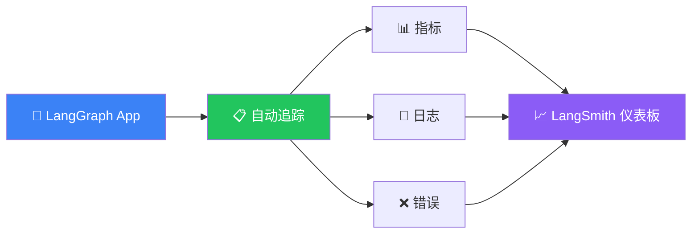

# 可观测性

## 这是什么？

可观测性 = 你能"看到" Agent 内部发生了什么。就像给 Agent 装了一个黑匣子——每次执行、每个节点、每个状态变化，全部记录下来。



## 配置

### 环境变量

```bash
# .env
export LANGCHAIN_TRACING_V2=true
export LANGCHAIN_API_KEY=lsv2_xxx
export LANGCHAIN_PROJECT=my-langgraph-app
```

### 代码中配置

```typescript
import { StateGraph, Annotation } from "@langchain/langgraph";

// 不需要额外代码！只要环境变量设好，
// 每次 graph.invoke() 都会自动追踪
const app = graph.compile();

// 这次执行会自动记录到 LangSmith
const result = await app.invoke(
  { messages: [{ role: "user", content: "你好" }] },
  { configurable: { thread_id: "user-123" } }
);
```

## 自动追踪的内容

开启追踪后，LangGraph 的每次执行都会自动记录：

| 数据 | 说明 |
|------|------|
| **节点输入/输出** | 每个节点收到什么、返回什么 |
| **状态流转路径** | 实际走了哪条路径 |
| **耗时** | 每个节点和整体的执行时间 |
| **Token 消耗** | LLM 调用用了多少 token |
| **错误信息** | 报错时的完整堆栈 |
| **模型参数** | temperature、model 等配置 |

## LangSmith 仪表板

访问 [smith.langchain.com](https://smith.langchain.com)：

```
┌────────────────────────────────────────────────────┐
│  LangSmith - my-langgraph-app                      │
├────────────────────────────────────────────────────┤
│  📈 最近 24h: 1,234 次调用 | 平均 320ms | 错误率 0.2%  │
├────────────────────────────────────────────────────┤
│  Trace #1234  agent → tools → agent  450ms  ✅     │
│  Trace #1233  agent → END            120ms  ✅     │
│  Trace #1232  agent → tools → ❌     890ms  ❌     │
└────────────────────────────────────────────────────┘
```

## 性能监控

### 关键指标

```typescript
// 你可以从 trace 中提取这些信息
const trace = await langsmithClient.readRun(runId);

console.log({
  latency: trace.latency,          // 延迟
  totalTokens: trace.total_tokens,  // 总 token
  promptTokens: trace.prompt_tokens,
  completionTokens: trace.completion_tokens,
  error: trace.error,              // 错误信息
});
```

### 设置告警

在 LangSmith 中配置：
- 延迟超过阈值时告警
- 错误率升高时告警
- Token 消耗异常时告警

## 自定义追踪

```typescript
// 添加自定义 metadata
const result = await app.invoke(
  { messages: [{ role: "user", content: "你好" }] },
  {
    configurable: { thread_id: "user-123" },
    metadata: {
      userId: "user-456",
      environment: "production",
      version: "1.2.0",
    },
  }
);
```

## 常见问题

| 问题 | 解决方案 |
|------|----------|
| 数据没有出现在 LangSmith | 检查 `LANGCHAIN_TRACING_V2=true` 是否生效 |
| API Key 报错 | 确认 `LANGCHAIN_API_KEY` 正确 |
| 数据太多看不过来 | 用 `LANGCHAIN_PROJECT` 分项目管理 |
| 生产环境担心性能 | 追踪是异步的，不影响主流程 |

## 下一步

- [Studio 调试](/langgraph/studio) — 可视化调试
- [流式输出](/langgraph/streaming) — 实时获取执行结果
- [持久化](/langgraph/persistence) — 保存执行状态
