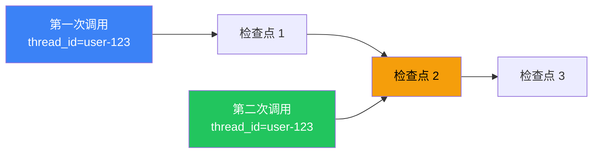

# 持久化（Persistence）

## 这是什么？

> 游戏存档。Agent 干到一半挂了，重启后从存档点继续，不用从头来。

## 使用方式

```typescript
import { MemorySaver } from "@langchain/langgraph";

// ① 创建检查点存储
const checkpointer = new MemorySaver(); // 内存中，开发用

// ② 编译图时启用持久化
const app = graph.compile({ checkpointer });

// ③ 执行时指定 thread_id（会话 ID）
const result = await app.invoke(
  { messages: [{ role: "user", content: "你好" }] },
  { configurable: { thread_id: "user-123" } }
);

// ④ 同一个 thread_id 再次调用，会从上次的存档点继续
const result2 = await app.invoke(
  { messages: [{ role: "user", content: "继续" }] },
  { configurable: { thread_id: "user-123" } }
);
```

## 存储后端

| 后端 | 说明 | 适用场景 |
|------|------|----------|
| `MemorySaver` | 内存 | 开发测试 |
| `SqliteSaver` | SQLite | 本地持久化 |
| `PostgresSaver` | PostgreSQL | 生产环境 |

## 完整示例



同一个 thread_id 多次调用，状态会自动延续：

```typescript
import { StateGraph, Annotation, START, END, MessagesAnnotation } from "@langchain/langgraph";
import { MemorySaver } from "@langchain/langgraph";

const StateAnnotation = Annotation.Root({
  ...MessagesAnnotation.spec,
});

const graph = new StateGraph(StateAnnotation)
  .addNode("agent", async (state) => {
    return {
      messages: [{ role: "assistant", content: `收到第 ${state.messages.length + 1} 条消息` }],
    };
  })
  .addEdge(START, "agent")
  .addEdge("agent", END)
  .compile();

const checkpointer = new MemorySaver();
const app = graph.compile({ checkpointer });

// 第一次调用
await app.invoke(
  { messages: [{ role: "user", content: "你好" }] },
  { configurable: { thread_id: "user-123" } }
);

// 第二次调用——能看到第一次的消息
const result = await app.invoke(
  { messages: [{ role: "user", content: "继续聊" }] },
  { configurable: { thread_id: "user-123" } }
);

console.log(result.messages.length); // 4（2 用户 + 2 助手）
```

## 下一步

- [持久化执行](/langgraph/durable-execution) — 持久化执行详解
- [时间旅行](/langgraph/time-travel) — 回溯历史执行
