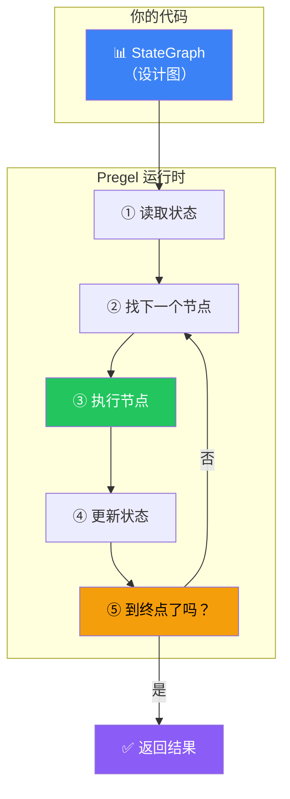
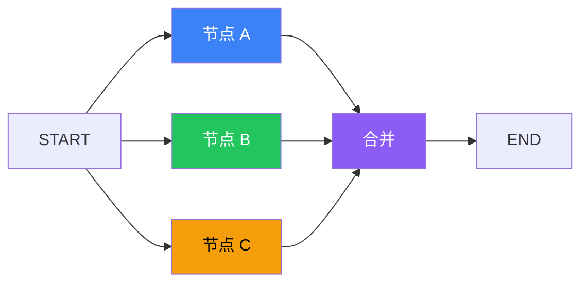

# 运行时（Pregel）

## 这是什么？

Pregel 是 LangGraph 的**底层执行引擎**。你画的流程图（StateGraph）只是"设计图"，Pregel 是真正"按图施工的工人"——它负责调度节点执行、管理状态流转、处理错误恢复。



## 工作原理

Pregel 使用**消息传递模型**（灵感来自 Google 的 Pregel 图计算框架）：

```
1. 读取当前状态（从检查点或初始输入）
2. 找到下一个要执行的节点（根据 Edges 定义）
3. 执行节点函数（传入当前状态，拿到状态更新）
4. 用 Reducer 合并状态更新到当前状态
5. 检查是否到达 END
   ├─ 否 → 回到第 2 步
   └─ 是 → 返回最终状态
```

## 执行模式

| 模式 | 说明 | 方法 |
|------|------|------|
| **同步执行** | 一步接一步，等上一个完成再执行下一个 | `invoke()` |
| **流式执行** | 每个节点执行完就返回结果 | `stream()` |
| **批量执行** | 多个输入并行处理 | `batch()` |

## 你不需要直接用它

大多数情况下，你用 `graph.compile()` 就够了。Pregel 在底层默默工作。

```typescript
// 你只管定义图和编译
const app = graph.compile({
  checkpointer: new MemorySaver(),  // 可选：持久化
  recursionLimit: 10,               // 可选：防止无限循环
});

// Pregel 在 invoke 内部自动调度
const result = await app.invoke({ messages: [] });
```

## 核心调度逻辑

```typescript
// 简化的 Pregel 执行伪代码
async function pregelExecute(graph, input) {
  let state = input;
  let currentNode = START;

  while (currentNode !== END) {
    // 1. 找到当前节点的定义
    const node = graph.nodes[currentNode];

    // 2. 执行节点
    const update = await node.execute(state);

    // 3. 用 reducer 合并状态
    state = mergeState(state, update);

    // 4. 根据边找到下一个节点
    currentNode = resolveNextNode(graph.edges, currentNode, state);

    // 5. 如果有检查点，保存状态
    if (checkpointer) {
      await checkpointer.put(state);
    }
  }

  return state;
}
```

## 并行执行

当多个节点没有依赖关系时，Pregel 会自动并行执行：



```typescript
// A、B、C 会并行执行，全部完成后才到 MERGE
const graph = new StateGraph(StateAnnotation)
  .addNode("A", nodeA)
  .addNode("B", nodeB)
  .addNode("C", nodeC)
  .addNode("MERGE", mergeNode)
  .addEdge(START, "A")
  .addEdge(START, "B")
  .addEdge(START, "C")
  .addEdge("A", "MERGE")
  .addEdge("B", "MERGE")
  .addEdge("C", "MERGE")
  .addEdge("MERGE", END);
```

## 错误处理

Pregel 内置了错误恢复机制：

| 场景 | 行为 |
|------|------|
| 节点抛异常 | 停止执行，保存最后的检查点 |
| 有持久化 | 可以从最后一个检查点恢复 |
| 超过 recursionLimit | 抛出错误，防止无限循环 |

## 最佳实践

| 建议 | 说明 |
|------|------|
| **不需要直接操作 Pregel** | 用 `graph.compile()` 就行 |
| **设置 recursionLimit** | 防止 Agent 循环死循环 |
| **开启持久化** | 错误时可以从存档恢复 |
| **用流式模式** | 实时看到执行进度 |

## 下一步

- [Graph API](/langgraph/graph-api) — 定义图的 API
- [持久化](/langgraph/persistence) — 保存执行状态
- [流式输出](/langgraph/streaming) — 实时获取结果
