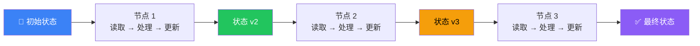

# State（状态）

## 这是什么？

状态 = 图在执行过程中记住的所有信息。就像游戏存档——每个节点读取存档、修改存档，然后传给下一个节点。



## 定义状态

```typescript
import { StateGraph, Annotation } from "@langchain/langgraph";

// 用 Annotation 定义状态结构
const StateAnnotation = Annotation.Root({
  // 消息列表：新消息追加到后面
  messages: Annotation<any[]>({
    reducer: (existing, update) => existing.concat(update),
    default: () => [],
  }),
  // 计数器：直接覆盖
  count: Annotation<number>({
    reducer: (existing, update) => update,
    default: () => 0,
  }),
  // 用户名：直接覆盖
  userName: Annotation<string>({
    reducer: (existing, update) => update,
    default: () => "",
  }),
  // 搜索结果：追加
  searchResults: Annotation<string[]>({
    reducer: (existing, update) => existing.concat(update),
    default: () => [],
  }),
});

// 创建图
const graph = new StateGraph(StateAnnotation);
```

## 状态通道（Channels）

状态里的每个字段都是一个"通道"。通道定义了两个关键行为：

| 配置 | 说明 | 示例 |
|------|------|------|
| `reducer` | 新值和旧值怎么合并 | 追加？覆盖？合并？ |
| `default` | 初始值是什么 | `[]`, `0`, `""` |

### Reducer 策略

```typescript
// ① 覆盖（默认）——新值替换旧值
count: Annotation<number>({
  reducer: (existing, update) => update,  // 直接返回新值
  default: () => 0,
})

// ② 追加——新值加到旧值后面
messages: Annotation<any[]>({
  reducer: (existing, update) => existing.concat(update),
  default: () => [],
})

// ③ 合并——深度合并对象
metadata: Annotation<Record<string, any>>({
  reducer: (existing, update) => ({ ...existing, ...update }),
  default: () => ({}),
})

// ④ 去重追加——追加但不重复
tags: Annotation<string[]>({
  reducer: (existing, update) => [...new Set([...existing, ...update])],
  default: () => [],
})
```

## 节点读写状态

```typescript
graph.addNode("greet", async (state) => {
  // ① 读取状态
  const name = state.userName;
  const count = state.count;

  // ② 返回状态更新（不是完整状态！）
  //    只返回需要更新的字段
  return {
    messages: [{ role: "assistant", content: `你好，${name}！这是第 ${count + 1} 次问候。` }],
    count: count + 1,  // 覆盖 count
  };
});

graph.addNode("search", async (state) => {
  const lastQuestion = state.messages.at(-1)?.content;
  const results = await searchWeb(lastQuestion);

  return {
    searchResults: results,  // 追加到 searchResults
  };
});
```

> ⚠️ **重要**：节点返回的是**状态更新（partial state）**，不是完整状态。LangGraph 会自动用 reducer 合并。

## 完整示例：对话 Agent

```typescript
import { StateGraph, Annotation, MessagesAnnotation } from "@langchain/langgraph";
import { ChatOpenAI } from "@langchain/openai";

// 使用内置的 MessagesAnnotation 管理消息
const AgentState = Annotation.Root({
  ...MessagesAnnotation.spec,    // 内置：messages 通道（自动追加）
  iterations: Annotation<number>({
    reducer: (existing, update) => update,
    default: () => 0,
  }),
});

const model = new ChatOpenAI({ model: "gpt-4o" });

// 节点：调用模型
const callModel = async (state) => {
  const response = await model.invoke(state.messages);
  return {
    messages: [response],           // 追加到消息列表
    iterations: state.iterations + 1,  // 更新计数
  };
};

// 构建图
const graph = new StateGraph(AgentState)
  .addNode("agent", callModel)
  .addEdge("__start__", "agent")
  .addEdge("agent", "__end__")
  .compile();
```

## 状态 vs 上下文

| 概念 | 说明 | 谁控制 |
|------|------|--------|
| **State** | 图执行过程中的数据 | 你定义结构和 reducer |
| **Context** | 传给 LLM 的输入 | LangGraph 自动管理 |

> State 是你定义的数据结构，Context 是 LangGraph 根据 State 生成的 LLM 输入。

## 最佳实践

1. **用 Annotation 定义**——类型安全，IDE 自动补全
2. **选对 reducer**——消息用追加，计数用覆盖
3. **返回 partial state**——只返回需要更新的字段
4. **用 MessagesAnnotation**——内置消息管理，省事
5. **状态要精简**——别存太多数据，会影响性能

## 下一步

- [Nodes（节点）](/langgraph/nodes) — 处理状态的函数
- [Edges（边）](/langgraph/edges) — 决定流转路径
- [Graph API](/langgraph/graph-api) — 图的完整 API
