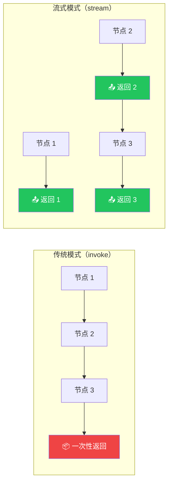

# 流式输出

## 这是什么？

流式输出 = 不用等整个流程跑完，**每个节点执行完就立刻返回结果**。就像快递一样——不是等所有包裹到齐再送，而是到了一件就送一件。



## 基本用法

```typescript
import { StateGraph, Annotation, START, END } from "@langchain/langgraph";
import { ChatOpenAI } from "@langchain/openai";

const StateAnnotation = Annotation.Root({
  messages: Annotation<any[]>({
    reducer: (x, y) => x.concat(y),
    default: () => [],
  }),
});

const model = new ChatOpenAI({ model: "gpt-4o" });

const graph = new StateGraph(StateAnnotation)
  .addNode("agent", async (state) => {
    const response = await model.invoke(state.messages);
    return { messages: [response] };
  })
  .addEdge(START, "agent")
  .addEdge("agent", END)
  .compile();

// 流式执行
const stream = await graph.stream({
  messages: [{ role: "user", content: "你好" }],
});

for await (const chunk of stream) {
  // 每个 chunk 是一个节点的输出
  console.log("收到 chunk:", JSON.stringify(chunk, null, 2));
}
```

## 流式模式对比

| 模式 | 说明 | 适用场景 |
|------|------|----------|
| `values` | 返回**完整状态**（每次都发全量） | 调试、想看完整状态 |
| `updates` | 只返回**状态更新**（推荐） | 生产环境、性能敏感 |
| `events` | 返回所有底层事件 | 需要精细控制 |

```typescript
// values 模式：每次都返回完整状态
const stream = await app.stream(input, { streamMode: "values" });

// updates 模式：只返回状态更新（推荐，更高效）
const stream = await app.stream(input, { streamMode: "updates" });

// 同时使用多种模式
const stream = await app.stream(input, { streamMode: ["values", "updates"] });
```

## 流式 LLM 输出

让 LLM 的回复也以流式返回（逐字输出）：

```typescript
import { ChatOpenAI } from "@langchain/openai";

const model = new ChatOpenAI({ model: "gpt-4o", streaming: true });

const graph = new StateGraph(StateAnnotation)
  .addNode("agent", async (state) => {
    // 使用 streamEvents 获取 LLM 流式输出
    const stream = await model.stream(state.messages);

    let fullContent = "";
    for await (const chunk of stream) {
      fullContent += chunk.content;
      process.stdout.write(chunk.content as string); // 逐字输出
    }

    return { messages: [{ role: "assistant", content: fullContent }] };
  })
  .addEdge(START, "agent")
  .addEdge("agent", END)
  .compile();
```

## 实战：SSE 流式 API

把流式输出接入 HTTP 接口，给前端实时展示：

```typescript
import express from "express";
import { graph } from "./graphs/chat";

const app = express();

app.post("/chat/stream", async (req, res) => {
  // 设置 SSE 头
  res.setHeader("Content-Type", "text/event-stream");
  res.setHeader("Cache-Control", "no-cache");
  res.setHeader("Connection", "keep-alive");

  const stream = await graph.stream({
    messages: [{ role: "user", content: req.body.message }],
  });

  for await (const chunk of stream) {
    // 发送 SSE 事件
    res.write(`data: ${JSON.stringify(chunk)}\n\n`);
  }

  res.write("data: [DONE]\n\n");
  res.end();
});

app.listen(3000);
```

## 实战：WebSocket 流式

```typescript
import { WebSocketServer } from "ws";

const wss = new WebSocketServer({ port: 8080 });

wss.on("connection", (ws) => {
  ws.on("message", async (data) => {
    const { message } = JSON.parse(data.toString());

    const stream = await graph.stream({
      messages: [{ role: "user", content: message }],
    });

    for await (const chunk of stream) {
      ws.send(JSON.stringify({ type: "chunk", data: chunk }));
    }

    ws.send(JSON.stringify({ type: "done" }));
  });
});
```

## 常见问题

| 问题 | 解决方案 |
|------|----------|
| 流式不生效 | 确认用 `stream()` 而不是 `invoke()` |
| 前端收不到数据 | 检查 SSE/WebSocket 头设置 |
| chunk 太大 | 用 `updates` 模式，只返回变化部分 |
| 顺序错乱 | 等待上一个 chunk 处理完再处理下一个 |

## 下一步

- [Studio 调试](/langgraph/studio) — 可视化调试
- [可观测性](/langgraph/observability) — 监控执行
- [部署](/langgraph/deployment) — 部署到生产环境
