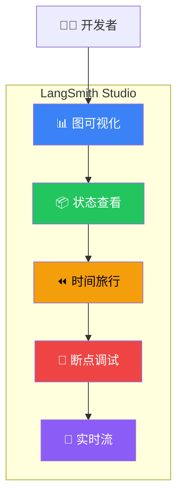

# Studio 调试

## 这是什么？

LangSmith Studio 是 LangGraph 的**可视化调试器**——就像前端的 Chrome DevTools，但专门给 AI Agent 用的。你在浏览器里就能看到图长什么样、每一步状态怎么变、哪里出了问题。



## 核心功能

| 功能 | 说明 | 使用场景 |
|------|------|----------|
| **图可视化** | 看到节点和边的完整连接关系 | 确认流程是否正确 |
| **状态查看** | 每个节点执行后的完整状态快照 | 检查数据是否符合预期 |
| **时间旅行** | 回溯到任意历史节点，修改输入重跑 | 调试分支逻辑 |
| **断点调试** | 在指定节点暂停，单步执行 | 定位问题节点 |
| **实时流** | 实时看到每个节点的输出流 | 监控执行过程 |

## 使用方式

### 1. 配置 LangSmith

```bash
# .env
export LANGCHAIN_TRACING_V2=true
export LANGCHAIN_API_KEY=lsv2_xxx
export LANGCHAIN_PROJECT=my-langgraph-app
```

### 2. 编译图并运行

```typescript
import { StateGraph, Annotation, START, END } from "@langchain/langgraph";

const StateAnnotation = Annotation.Root({
  messages: Annotation<any[]>({
    reducer: (x, y) => x.concat(y),
    default: () => [],
  }),
});

const graph = new StateGraph(StateAnnotation)
  .addNode("agent", async (state) => {
    const response = await model.invoke(state.messages);
    return { messages: [response] };
  })
  .addEdge(START, "agent")
  .addEdge("agent", END)
  .compile();

// 正常执行——数据会自动发送到 LangSmith
const result = await graph.invoke({
  messages: [{ role: "user", content: "你好" }],
});
```

### 3. 在 Studio 中查看

1. 访问 [smith.langchain.com](https://smith.langchain.com)
2. 选择你的项目
3. 点击最近一次执行的 trace
4. 进入 Studio 界面

## Studio 截图示意

```
┌─────────────────────────────────────────────┐
│  LangSmith Studio                           │
├──────────┬──────────────────────────────────┤
│ 图视图    │  状态详情                        │
│          │                                  │
│  START   │  {                               │
│    ↓     │    "messages": [...],            │
│  AGENT ──┤    "step": 3                     │
│    ↓     │  }                               │
│   END    │                                  │
│          │  耗时: 1.2s | Token: 342         │
└──────────┴──────────────────────────────────┘
```

## 调试技巧

### 断点调试

在 Studio 中点击节点 → 设置断点 → 执行到该节点自动暂停

### 修改状态重跑

1. 选择一个历史检查点
2. 修改状态（比如换个用户输入）
3. 从那个节点重新执行

### 对比不同路径

同时开两个时间旅行分支，对比结果差异

## 最佳实践

| 建议 | 说明 |
|------|------|
| **开发时开启 tracing** | 设 `LANGCHAIN_TRACING_V2=true` |
| **给节点起有意义的名字** | Studio 里显示的就是节点名 |
| **用断点调试条件边** | 确认路由逻辑是否正确 |
| **善用时间旅行** | 不用每次从头跑，省时间 |

## 下一步

- [可观测性](/langgraph/observability) — 生产环境监控
- [时间旅行](/langgraph/time-travel) — 回溯历史执行
- [流式输出](/langgraph/streaming) — 实时获取执行结果
