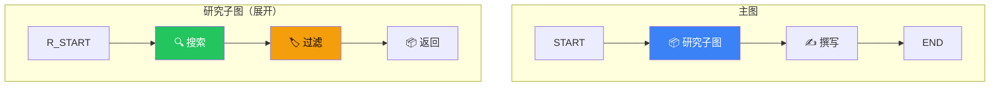

# Subgraphs（子图）

## 这是什么？

子图 = 图中嵌套的另一个图。就像函数里调用另一个函数——主图负责整体流程，子图负责具体细节。



## 类比

> 主图 = 公司整体流程（接单 → 生产 → 发货）
> 子图 = 生产部门的内部流程（采购 → 加工 → 质检）

你不需要知道生产部门内部怎么运作，只要把原料给它、拿到成品就行。

## 基本用法

```typescript
import { StateGraph, Annotation, START, END } from "@langchain/langgraph";

// ① 定义子图的状态
const SearchState = Annotation.Root({
  query: Annotation<string>,
  results: Annotation<string[]>({
    reducer: (_, update) => update,
    default: () => [],
  }),
  filteredResults: Annotation<string[]>({
    reducer: (_, update) => update,
    default: () => [],
  }),
});

// ② 构建子图
const searchGraph = new StateGraph(SearchState)
  .addNode("search", async (state) => {
    const results = await webSearch(state.query);
    return { results };
  })
  .addNode("filter", async (state) => {
    const filtered = state.results.filter((r) => r.score > 0.7);
    return { filteredResults: filtered };
  })
  .addEdge(START, "search")
  .addEdge("search", "filter")
  .addEdge("filter", END)
  .compile();

// ③ 定义主图的状态
const MainState = Annotation.Root({
  topic: Annotation<string>,
  research: Annotation<string>({ default: () => "" }),
  article: Annotation<string>({ default: () => "" }),
});

// ④ 在主图中使用子图
const mainGraph = new StateGraph(MainState)
  .addNode("research", searchGraph)  // 子图作为节点
  .addNode("write", async (state) => {
    const article = await llm.invoke(`基于研究写文章：${state.research}`);
    return { article: article.content as string };
  })
  .addEdge(START, "research")
  .addEdge("research", "write")
  .addEdge("write", END)
  .compile();
```

## 状态映射

当子图和主图的状态结构不同时，需要做状态映射：

```typescript
// 子图用 SearchState，主图用 MainState
// 在使用子图时做映射
const mainGraph = new StateGraph(MainState)
  .addNode("research", async (state) => {
    // 手动映射：主图 → 子图
    const subResult = await searchGraph.invoke({
      query: state.topic,
    });
    // 手动映射：子图 → 主图
    return {
      research: subResult.filteredResults.map((r) => r.content).join("\n"),
    };
  })
  // ...
  .compile();
```

## 好处

| 好处 | 说明 |
|------|------|
| **模块化** | 每个子图独立开发和测试 |
| **复用** | 同一个子图在多个主图中使用 |
| **隔离** | 子图有自己的状态，不会污染主图 |
| **团队协作** | 不同人负责不同的子图 |

## 实战：多 Agent 系统

```typescript
// Agent A：负责搜索
const searchAgent = new StateGraph(AgentState)
  .addNode("search", searchNode)
  .addNode("evaluate", evaluateNode)
  .addEdge(START, "search")
  .addEdge("search", "evaluate")
  .addConditionalEdges("evaluate", (s) => (s.quality > 0.7 ? END : "search"))
  .compile();

// Agent B：负责写作
const writeAgent = new StateGraph(AgentState)
  .addNode("outline", outlineNode)
  .addNode("draft", draftNode)
  .addNode("revise", reviseNode)
  .addEdge(START, "outline")
  .addEdge("outline", "draft")
  .addEdge("draft", "revise")
  .addConditionalEdges("revise", (s) => (s.done ? END : "draft"))
  .compile();

// 主图：协调两个 Agent
const orchestrator = new StateGraph(MainState)
  .addNode("searcher", searchAgent)
  .addNode("writer", writeAgent)
  .addEdge(START, "searcher")
  .addEdge("searcher", "writer")
  .addEdge("writer", END)
  .compile();
```

## 常见问题

| 问题 | 解决方案 |
|------|----------|
| 状态不一致 | 确保子图状态和主图状态兼容，或手动映射 |
| 子图报错影响主图 | 在子图内做好错误处理 |
| 想让子图访问主图状态 | 通过参数传递，不要依赖隐式共享 |

## 下一步

- [State（状态）](/langgraph/state) — 状态定义和管理
- [应用结构](/langgraph/application-structure) — 推荐的项目结构
- [节点](/langgraph/nodes) — 节点类型详解
