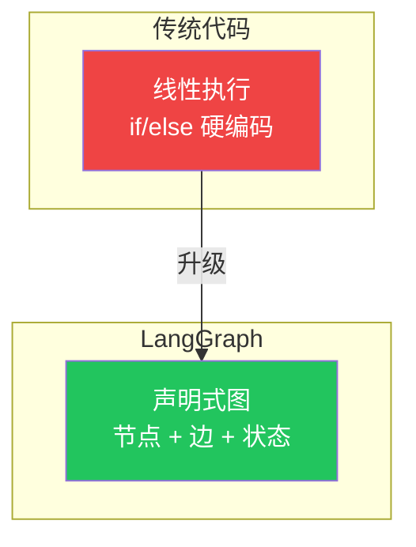
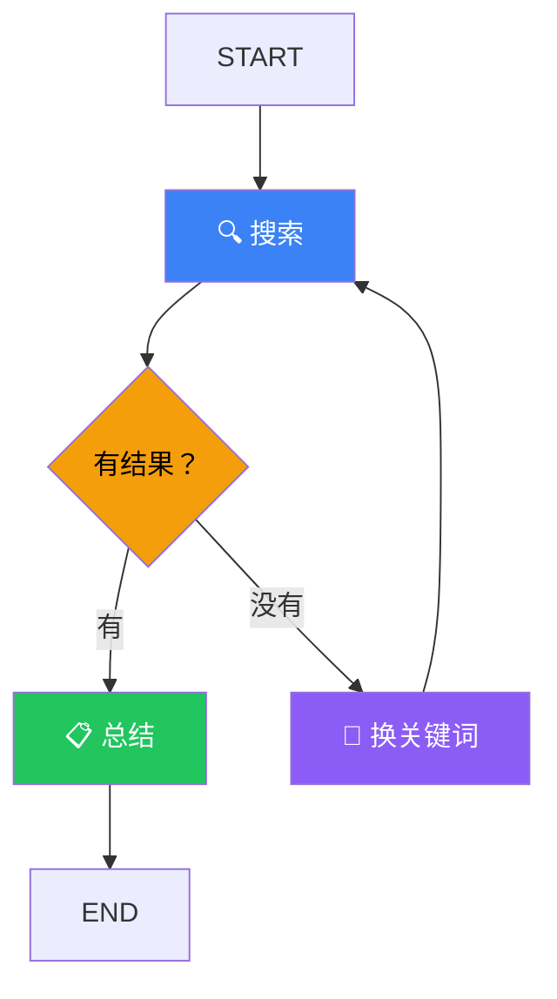

# Thinking in LangGraph

## 核心思维转变



> **普通 Agent**：你说一句话，它回一句话
> **LangGraph Agent**：你画一张流程图，它按图执行

## 怎么用 LangGraph 的方式思考？

### 1. 先画图，再写代码



### 2. 每个圆圈是一个"节点"

- 节点 = 一个函数
- 输入：当前状态
- 输出：状态更新

### 3. 箭头是"边"

- 固定边：A 干完一定去 B
- 条件边：根据结果决定去 B 还是去 C

## 与普通代码的区别

```typescript
// ❌ 普通代码：硬编码流程
async function run() {
  const searchResult = await search(query);
  if (searchResult.length > 0) {
    return summarize(searchResult);
  } else {
    const newQuery = await rephrase(query);
    return await search(newQuery); // 简单逻辑还行
  }
}

// ✅ LangGraph：声明式流程
const graph = new StateGraph(/* ... */)
  .addNode("search", searchNode)
  .addNode("summarize", summarizeNode)
  .addNode("rephrase", rephraseNode)
  .addConditionalEdges("search", (state) => {
    if (state.results.length > 0) return "summarize";
    return "rephrase";
  })
  .addEdge("rephrase", "search"); // 循环
```

## 什么时候该用 LangGraph？

| 场景 | 用 LangGraph | 用普通 Agent |
|------|-------------|-------------|
| 简单一问一答 | ❌ | ✅ |
| 多步骤工作流 | ✅ | ❌ |
| 条件分支 | ✅ | ❌ |
| 循环执行 | ✅ | ❌ |
| 需要持久化 | ✅ | ❌ |
| 需要人工介入 | ✅ | ❌ |

## 下一步

- [工作流 vs Agent](/langgraph/workflows-agents)
- [两种 API 怎么选](/langgraph/api-choice)
