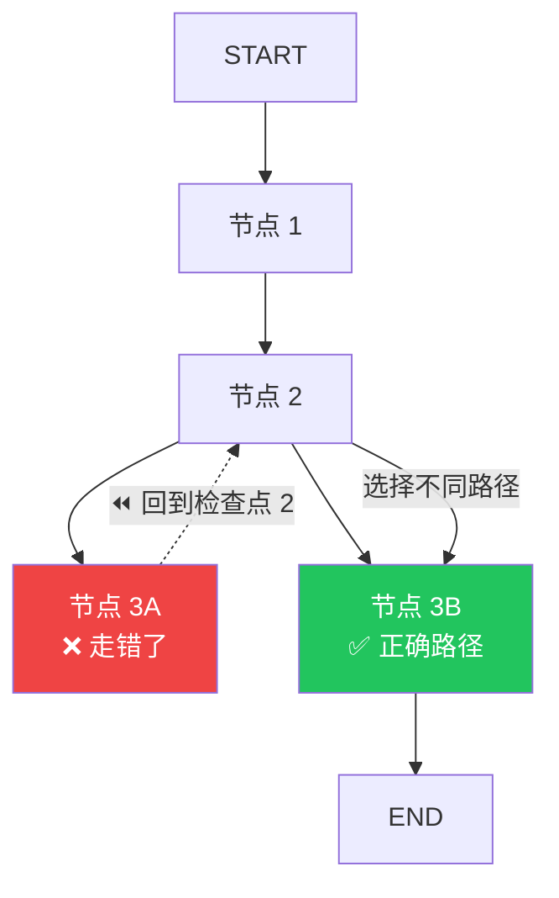

# 时间旅行（Time-travel）

## 这是什么？

时间旅行 = 回到过去的某个节点，走一条不同的路。就像游戏的"读档"——存了一个档，后面走错了，读档重来。



## 为什么需要？

| 场景 | 说明 |
|------|------|
| 🐛 **调试** | Agent 做错了，回到出错前的节点分析原因 |
| 🔀 **探索** | 同一个问题，试不同的处理路径 |
| 📊 **对比** | 比较不同路径的结果哪个更好 |
| 🔄 **重试** | 失败了不用从头来，从检查点重试 |

## 前置条件

时间旅行需要**持久化**——必须有检查点才能回溯：

```typescript
import { MemorySaver } from "@langchain/langgraph";

const checkpointer = new MemorySaver();
const app = graph.compile({ checkpointer });
```

## 完整示例

```typescript
import { StateGraph, Annotation, START, END } from "@langchain/langgraph";
import { MemorySaver } from "@langchain/langgraph";

const StateAnnotation = Annotation.Root({
  messages: Annotation<any[]>({
    reducer: (x, y) => x.concat(y),
    default: () => [],
  }),
  decision: Annotation<string>({ default: () => "" }),
});

// 节点：分析
const analyzeNode = async (state) => {
  const lastMsg = state.messages.at(-1)?.content;
  // 假设这里做了一些分析
  return {
    decision: "option_a",
    messages: [{ role: "assistant", content: `分析完成，选择: option_a` }],
  };
};

// 节点：执行（根据 decision 走不同路径）
const executeNode = async (state) => {
  return {
    messages: [{ role: "assistant", content: `执行了 ${state.decision}` }],
  };
};

const graph = new StateGraph(StateAnnotation)
  .addNode("analyze", analyzeNode)
  .addNode("execute", executeNode)
  .addEdge(START, "analyze")
  .addEdge("analyze", "execute")
  .addEdge("execute", END)
  .compile();

// ---- 开始时间旅行 ----

const checkpointer = new MemorySaver();
const app = graph.compile({ checkpointer });

// ① 正常执行
const result = await app.invoke(
  { messages: [{ role: "user", content: "分析这个数据" }] },
  { configurable: { thread_id: "session-1" } }
);

console.log(result.messages.at(-1)); // 执行了 option_a

// ② 获取所有检查点（存档点）
const history = [];
for await (const state of app.getStateHistory({
  configurable: { thread_id: "session-1" },
})) {
  history.push(state);
}

console.log(`共 ${history.length} 个检查点`);
// 输出：共 4 个检查点（START → analyze → execute → END）

// ③ 回到 analyze 节点之后，修改 decision 再执行
const checkpoint = history[1]; // analyze 执行完后的检查点

const forked = await app.invoke(
  null,
  {
    configurable: {
      thread_id: "session-1",
      checkpoint_id: checkpoint.id,
    },
  }
);

console.log(forked.messages.at(-1)); // 执行了 option_a
```

## 在 Studio 中使用

时间旅行在 LangSmith Studio 中更好用——可视化界面直接点击检查点：

1. 打开 Studio → 选择一次执行
2. 看到完整的检查点时间线
3. 点击任意检查点 → 查看当时的状态
4. 修改输入 → 从该点重新执行
5. 对比不同路径的结果

## 检查点结构

```typescript
interface Checkpoint {
  id: string;              // 检查点 ID
  timestamp: string;       // 创建时间
  state: {                 // 当时的状态
    messages: Message[];
    [key: string]: any;
  };
  parent_id: string | null; // 父检查点 ID
  step: number;             // 执行步数
  metadata: Record<string, any>;
}
```

## 实战：A/B 测试 Agent 路径

```typescript
// 路径 A：直接回答
const pathA = await app.invoke(null, {
  configurable: {
    thread_id: "ab-test",
    checkpoint_id: forkPoint.id,
  },
  // 假设节点会读取这个来决定路径
});

// 路径 B：先搜索再回答
const pathB = await app.invoke(null, {
  configurable: {
    thread_id: "ab-test-2",
    checkpoint_id: forkPoint.id,
  },
});

// 对比两个路径的结果
console.log("路径 A:", pathA.messages.at(-1));
console.log("路径 B:", pathB.messages.at(-1));
```

## 最佳实践

| 建议 | 说明 |
|------|------|
| **始终开启持久化** | 没有检查点就没有时间旅行 |
| **用有意义的 thread_id** | 方便后续查找历史 |
| **定期清理旧检查点** | 避免存储无限增长 |
| **Studio 更直观** | 复杂调试建议用 Studio |

## 下一步

- [持久化](/langgraph/persistence) — 保存执行状态
- [Studio 调试](/langgraph/studio) — 可视化调试
- [人工介入](/langgraph/human-in-the-loop) — 人工确认
