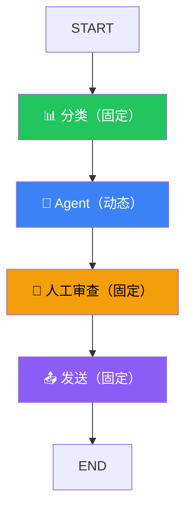

# 工作流 vs Agent

## 两种模式

| | 工作流（Workflow） | Agent |
|--|-------------------|-------|
| 流程 | 固定的，开发者定义好的 | 动态的，Agent 自己决定 |
| 类比 | 工厂流水线 | 自由职业者 |
| 适用 | 流程确定的任务 | 需要推理和判断的任务 |
| 可预测性 | 高 | 低 |

## 工作流示例

```typescript
// 流程固定：搜索 → 总结 → 格式化
const workflow = new StateGraph(/* ... */)
  .addNode("search", searchNode)
  .addNode("summarize", summarizeNode)
  .addNode("format", formatNode)
  .addEdge(START, "search")
  .addEdge("search", "summarize")
  .addEdge("summarize", "format")
  .addEdge("format", END);
```

## Agent 示例

```typescript
// 流程动态：Agent 自己决定下一步做什么
const agent = new StateGraph(/* ... */)
  .addNode("agent", callModel)
  .addNode("tools", toolNode)
  .addEdge(START, "agent")
  .addConditionalEdges("agent", (state) => {
    // Agent 自己决定：调工具还是结束
    const last = state.messages[state.messages.length - 1];
    return last.tool_calls?.length ? "tools" : END;
  })
  .addEdge("tools", "agent"); // 工具执行完回到 Agent
```

## 混合使用

实际项目中经常混合使用——某些步骤固定，某些步骤由 Agent 决定。



上图就是一个混合例子：分类和发送是固定流程，Agent 自主决定怎么处理，人工审查是固定环节。

## 下一步

- [两种 API 怎么选](/langgraph/api-choice)
- [Graph API](/langgraph/graph-api)
