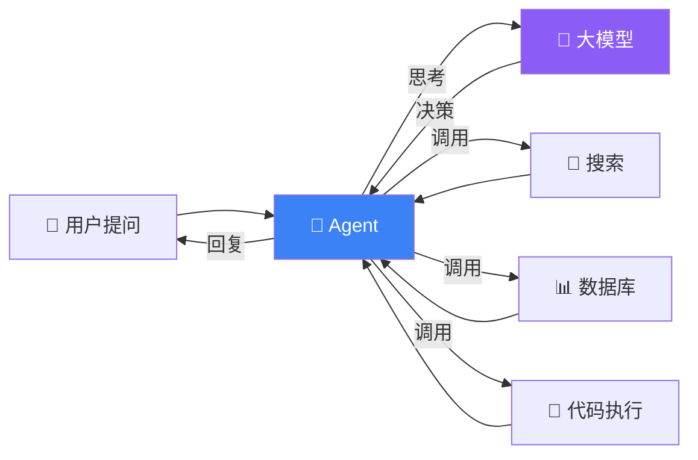
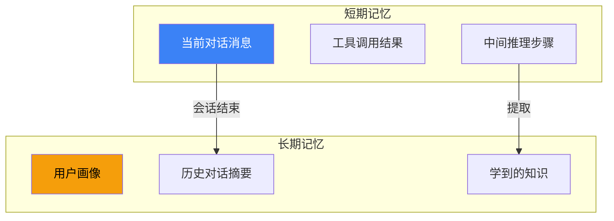
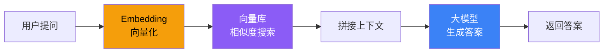

# 核心概念

在深入代码之前，先搞清楚几个关键概念。理解这些，后面的文档读起来会轻松很多。

## Agent 是什么？

Agent = 大模型 + 决策能力 + 工具。它不只是"你问它答"，而是能**自己决定**要不要调用工具、调哪个工具、怎么组合结果。



类比：普通聊天机器人 = 前台接待（只能回答常见问题）；Agent = 专业顾问（能查资料、做分析、出方案）。

## 上下文管理（Context）

Agent 的"工作记忆"——它在执行任务时能看到什么信息。

| 类型 | 说明 | 类比 |
|------|------|------|
| **系统提示** | 定义 Agent 的角色和行为规则 | 岗位说明书 |
| **对话历史** | 用户和 Agent 之间的消息记录 | 聊天记录 |
| **工具返回值** | 工具调用后的结果 | 查完天气后返回的数据 |
| **检索结果** | 从知识库中找到的相关文档 | 图书管理员帮你找到的资料 |
| **外部注入** | 手动传入的额外信息 | "这是客户的订单号" |

> ⚠️ 上下文太多会超出模型的上下文窗口，需要**压缩、摘要、裁剪**——这就是上下文工程（Context Engineering）要解决的问题。

## 记忆体系（Memory）

| 类型 | 时长 | 存储位置 | 用途 | 类比 |
|------|------|----------|------|------|
| **短期记忆** | 单次会话 | 内存中 | 当前对话的上下文 | 短期工作记忆 |
| **长期记忆** | 跨会话 | 数据库/文件 | 用户偏好、历史总结、个人资料 | 长期记忆 |



## 工具调用（Tool Calling）

工具 = Agent 能力的延伸。Agent 自己不能发 HTTP 请求，但它可以调用"搜索工具"来实现。

```typescript
import { tool } from "langchain";
import { z } from "zod";

// 定义一个工具：查天气
const getWeather = tool(
  ({ city }) => {
    // 实际项目中这里会调用天气 API
    return `${city}：晴天，25°C`;
  },
  {
    name: "get_weather",
    description: "查询指定城市的天气",  // ⚠️ 描述很重要，Agent 靠它决定是否调用
    schema: z.object({
      city: z.string().describe("城市名称"),
    }),
  }
);
```

> 💡 **关键**：工具的 `description` 写得好不好，直接决定 Agent 能不能正确使用它。

## 检索增强生成（RAG）

RAG = 先检索，再生成。不是让模型凭记忆回答，而是先从你的文档中找到相关内容，再基于这些内容生成答案。



类比：考试时 RAG = 开卷考试（能翻书找答案），纯模型 = 闭卷考试（全凭记忆）。

## 常见问题

| 问题 | 解答 |
|------|------|
| Agent 和 Chain 有什么区别？ | Chain 是固定流程，Agent 是动态决策 |
| Context 和 Memory 是一回事吗 | 不完全。Context 是单次执行的输入，Memory 是跨会话的持久化 |
| RAG 必须用向量库吗？ | 不必须，但向量库是最高效的语义检索方式 |
| 工具调用安全吗？ | 需要验证和限制，不要让 Agent 无限制执行 |

## 下一步

- [上下文工程详解 →](/deepagents/context-engineering)
- [短期记忆 →](/langchain/short-term-memory)
- [长期记忆 →](/langchain/long-term-memory)
- [工具 →](/langchain/tools)
