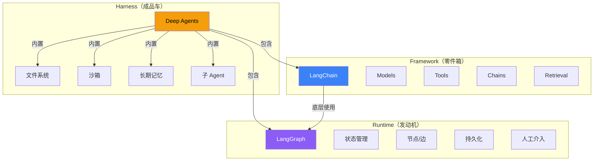

# 框架 vs 运行时 vs Harness

这三个概念容易混淆，但理解它们的区别对选型至关重要。

## 一句话类比

| 概念 | 类比 | 代表产品 | 说明 |
|------|------|----------|------|
| **Framework（框架）** | 乐高积木 | LangChain | 提供各种构件（模型、工具、链），你自己组装 |
| **Runtime（运行时）** | 汽车发动机 | LangGraph | 负责执行、状态管理、持久化、错误恢复 |
| **Harness（套件）** | 成品汽车 | Deep Agents | 开箱即用，内置框架 + 运行时 + 额外功能 |

## 它们的关系



**公式：Deep Agents = LangChain + LangGraph + 内置增强（子 Agent、文件系统、沙箱等）**

## 深入理解

### Framework（框架）— LangChain

框架提供"原材料"：模型接入、工具定义、链式调用、检索组件。你需要自己把这些拼装成 Agent。

```typescript
// LangChain：自己组装
import { createAgent, tool } from "langchain";
import { z } from "zod";

const agent = createAgent({
  model: "openai:gpt-4o",
  tools: [myCustomTool],
  system: "你是一个助手",
});
// 底层自动使用 LangGraph 执行
```

**适合**：需要灵活控制 Agent 行为、自定义组件、特定业务逻辑。

### Runtime（运行时）— LangGraph

运行时负责"怎么跑"：状态如何流转、节点之间怎么跳转、出错怎么恢复、能不能暂停等人。

```typescript
// LangGraph：直接操控状态图
import { StateGraph, Annotation } from "@langchain/langgraph";

const State = Annotation.Root({
  messages: Annotation<string[]>({ reducer: (a, b) => a.concat(b) }),
});

const graph = new StateGraph(State)
  .addNode("research", researchNode)
  .addNode("write", writeNode)
  .addEdge("research", "write")
  .addEdge("__start__", "research")
  .compile();
```

**适合**：复杂工作流、条件分支、循环、持久化、人工介入、时间旅行调试。

### Harness（套件）— Deep Agents

Harness 把框架和运行时打包好了，加上了开箱即用的高级功能（子 Agent、文件系统、沙箱等）。

```typescript
// Deep Agents：一行搞定
import { createDeepAgent } from "deepagents";

const agent = createDeepAgent({
  tools: [myTool],
  system: "你是一个助手",
  // 自带子 Agent、文件系统、沙箱、长期记忆
});
```

**适合**：快速原型、不想操心底层实现、需要子 Agent 和沙箱等高级功能。

## 怎么选？

| 你的需求 | 选什么 | 理由 |
|----------|--------|------|
| 快速做出一个能用的 Agent | **Harness**（Deep Agents） | 开箱即用，零配置 |
| 需要灵活控制 Agent 行为 | **Framework**（LangChain） | 自由组合构件 |
| 需要复杂工作流和状态管理 | **Runtime**（LangGraph） | 精细控制执行流程 |
| 三者都要 | 直接用 **Deep Agents** | 它是三者的集合 |

> 💡 **简单理解**：买现成车 = Harness，买零件自己组装 = Framework，只买发动机 = Runtime。

## 常见问题

| 问题 | 解答 |
|------|------|
| 用 Deep Agents 还需要学 LangChain 吗？ | 不需要，但如果需要深度定制，了解 LangChain 会有帮助 |
| LangGraph 能独立使用吗？ | 能。它是最底层，不依赖 LangChain |
| 三个可以混用吗？ | 可以。Deep Agents 内部就用了 LangChain 和 LangGraph |

## 下一步

- [产品关系与选型指南 →](/overview/product-comparison)
- [快速开始 →](/overview/quickstart)
- [Deep Agents 详解 →](/deepagents/)
