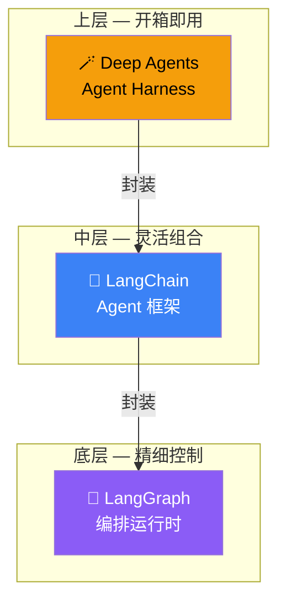
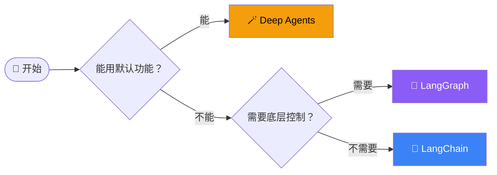

# 概述

LangChain 是一个 **Agent 工程平台**，帮助开发者用 TypeScript/JavaScript 构建可靠的 AI Agent 应用。从 Clay、Rippling 到 Cloudflare，越来越多公司的 AI 团队在 LangChain 生态上构建产品。

## 为什么需要 Agent 工程平台？

传统的"大模型 + Prompt"模式只能做简单问答。一旦你需要：

- 调用外部工具（搜索、数据库、API）
- 多步骤推理和规划
- 跨会话的记忆
- 多个 Agent 协作

就会发现需要一套工程化的框架来管理这些复杂性。LangChain 生态就是为此而生。

## 三层产品体系

| 产品 | 定位 | 类比 | 适合场景 |
|------|------|------|----------|
| **Deep Agents** | 开箱即用的 Agent Harness | 成品汽车 | 快速构建复杂 Agent，自带子 Agent、文件系统、长期记忆 |
| **LangChain** | Agent 开发框架 | 乐高零件 | 需要自定义 Agent 行为，灵活组合模型、工具、链 |
| **LangGraph** | 底层编排运行时 | 汽车发动机 | 复杂工作流，需要持久化、人工介入、时间旅行 |

## 核心能力一览

| 能力 | 说明 | 对应模块 |
|------|------|----------|
| **模型接入** | OpenAI、Anthropic、Google 等主流模型开箱即用 | [Chat 集成](/integrations/chat) |
| **工具调用** | 搜索、数据库、自定义函数等外部能力 | [工具集成](/integrations/tools) |
| **RAG 检索增强** | 从文档中检索相关信息，辅助模型生成 | [RAG 教程](/tutorials/rag-qa) |
| **记忆系统** | 短期对话记忆 + 长期用户记忆 | [核心概念](/overview/concepts) |
| **工作流编排** | 条件分支、循环、并行、人工介入 | [LangGraph](/langgraph/) |
| **可观测性** | 日志、追踪、监控 | [回调集成](/integrations/callbacks) |

## 选型建议

- 🆕 **刚入门** → 从 [Deep Agents](/deepagents/) 开始，最快上手
- 🔧 **需要定制** → 用 [LangChain](/langchain/) 的 Agent 模块
- 🏗️ **复杂工作流** → 用 [LangGraph](/langgraph/) 底层编排

## 生态全景

LangChain 不只是框架本身，它是一个完整的生态系统：

- **LangSmith** — 可观测性平台，调试、测试、监控 Agent
- **LangGraph Platform** — 部署和管理 LangGraph 应用的平台
- **LangChain Templates** — 可复用的 Agent 模板
- **社区集成** — 数百个社区维护的模型、工具、存储集成

## 下一步

- [产品关系与选型指南 →](/overview/product-comparison)
- [快速开始 →](/overview/quickstart)
- [核心概念 →](/overview/concepts)
