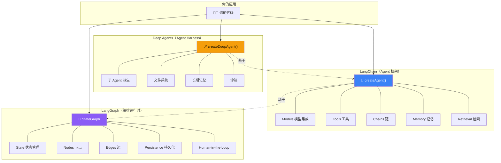
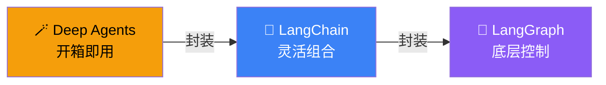
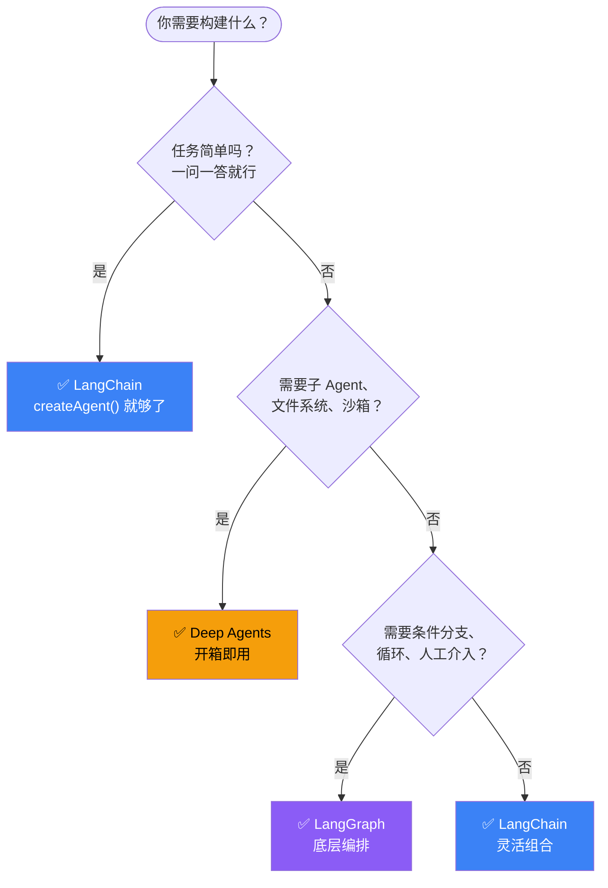

# 产品关系与选型指南

## 架构全景

## 一句话总结

> **Deep Agents = LangChain + LangGraph + 内置增强功能（子 Agent、文件系统、沙箱、长期记忆）。**

## 三层关系

- **Deep Agents** 在 LangChain 基础上增加了子 Agent、文件系统、沙箱等功能
- **LangChain** 的 Agent 底层自动使用 LangGraph
- **LangGraph** 是最底层，独立运行

## 详细对比

| 维度 | 🪄 Deep Agents | 🦜 LangChain | 🔷 LangGraph |
|------|----------------|--------------|--------------|
| **定位** | Agent Harness | Agent 框架 | 编排运行时 |
| **上手难度** | ⭐ 最简单 | ⭐⭐ 中等 | ⭐⭐⭐ 需要理解底层 |
| **灵活性** | 中等 | 高 | 最高 |
| **安装** | `deepagents` | `langchain` | `@langchain/langgraph` |
| **内置功能** | 子 Agent、文件系统、沙箱、记忆 | 模型集成、工具、链、检索 | 状态图、持久化、中断、时间旅行 |
| **适合场景** | 快速原型、复杂多步骤任务 | 自定义 Agent、RAG | 复杂工作流、生产级 |

## 选型流程

## 常见问题

**Q: 我需要学 LangGraph 才能用 LangChain 吗？**
A: **不需要。** LangChain 的 Agent 底层自动调用 LangGraph，你不需要直接接触它。只有需要底层控制时才直接用 LangGraph。

**Q: Deep Agents 和 LangChain 的 Agent 有什么区别？**
A: Deep Agents 是 LangChain Agent 的"增强版"，内置了子 Agent、文件系统、沙箱、长期记忆等。如果你不需要这些，用 LangChain 的 Agent 就够了。

**Q: 三个可以混用吗？**
A: **可以。** Deep Agents 内部就用了 LangChain 和 LangGraph。你可以根据需要在不同层级切换。

## 下一步

- [框架 vs 运行时 vs Harness 详解](/overview/frameworks-runtimes-harnesses)
- [快速开始](/overview/quickstart)
- [核心概念](/overview/concepts)
