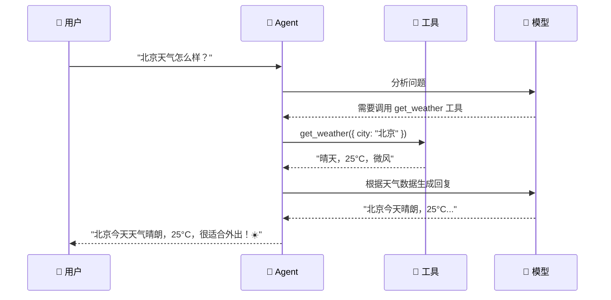

# 快速开始

## 前置条件

- **Node.js** v18 或更高版本
- **npm** 包管理器
- 一个 **LLM API Key**（OpenAI / Anthropic 等）

## 安装流程


---

## 方式一：Deep Agents（推荐新手）

最快上手的方式，开箱即用。

### ① 创建项目

```bash
mkdir my-first-agent && cd my-first-agent
npm init -y
```

### ② 安装依赖

```bash
npm install deepagents @langchain/core zod
```

### ③ 配置 API Key

```bash
# 创建 .env 文件
echo 'OPENAI_API_KEY=sk-your-key-here' > .env
```

### ④ 写代码

```typescript
// index.ts
import { createDeepAgent } from "deepagents";
import { tool } from "langchain";
import { z } from "zod";

// ① 定义一个工具：查天气
const getWeather = tool(
  ({ city }) => {
    // 模拟天气数据（实际项目中调用天气 API）
    const weatherMap: Record<string, string> = {
      "北京": "晴天，25°C，微风",
      "上海": "多云，22°C，东南风",
      "深圳": "阵雨，28°C，南风",
    };
    return weatherMap[city] || `${city}：暂无天气数据`;
  },
  {
    name: "get_weather",
    description: "查询指定城市的天气",
    schema: z.object({
      city: z.string().describe("城市名称，如：北京、上海"),
    }),
  }
);

// ② 创建 Agent
const agent = createDeepAgent({
  tools: [getWeather],
  system: "你是一个天气查询助手。用户问天气时，调用 get_weather 工具。回答要简洁友好。",
});

// ③ 调用 Agent
async function main() {
  const result = await agent.invoke({
    messages: [{ role: "user", content: "北京今天天气怎么样？" }],
  });

  // 打印最后一条消息（Agent 的回复）
  const lastMessage = result.messages[result.messages.length - 1];
  console.log("Agent 回复：", lastMessage.content);
}

main();
```

### ⑤ 运行

```bash
npx tsx index.ts
```

**预期输出：**
```
Agent 回复：北京今天天气晴朗，25°C，有微风，很适合外出！☀️
```

---

## 方式二：LangChain Agent

需要更多自定义控制时使用。

### ① 安装

```bash
mkdir my-langchain-agent && cd my-langchain-agent
npm init -y
npm install langchain @langchain/openai zod
```

### ② 写代码

```typescript
import { createAgent, tool } from "langchain";
import { z } from "zod";

// 定义工具
const calculator = tool(
  ({ expression }) => {
    try {
      // ⚠️ 注意：eval 仅用于演示，生产环境请用安全的数学解析库
      const result = eval(expression);
      return `${expression} = ${result}`;
    } catch {
      return `无法计算：${expression}`;
    }
  },
  {
    name: "calculator",
    description: "计算数学表达式，如：1+1、3*4、(10+5)/3",
    schema: z.object({
      expression: z.string().describe("数学表达式"),
    }),
  }
);

// 创建 Agent
const agent = createAgent({
  model: "openai:gpt-4o-mini",  // 用 mini 版省成本
  tools: [calculator],
  system: "你是一个数学助手。计算时请使用 calculator 工具。",
});

// 调用
async function main() {
  const result = await agent.invoke({
    messages: [{ role: "user", content: "帮我算一下 (123 + 456) * 789 等于多少？" }],
  });

  const lastMessage = result.messages[result.messages.length - 1];
  console.log("Agent 回复：", lastMessage.content);
}

main();
```

### ③ 运行

```bash
npx tsx index.ts
```

---

## 方式三：LangGraph（底层编排）

需要构建复杂工作流时使用。

详见 [LangGraph 快速开始](/langgraph/quickstart)。

---

## 执行流程



## 常见问题

| 问题 | 解决方案 |
|------|----------|
| `Module not found` | 检查 npm install 是否成功 |
| `API key invalid` | 检查 `.env` 文件中的 API Key |
| `Agent 不调用工具` | 检查工具的 `description` 是否清晰 |
| `TypeScript 报错` | 确保 `tsconfig.json` 中 `module` 设为 `"ESNext"` |

## 下一步

- [Deep Agents 详解](/deepagents/)
- [LangChain 详解](/langchain/)
- [LangGraph 详解](/langgraph/)
