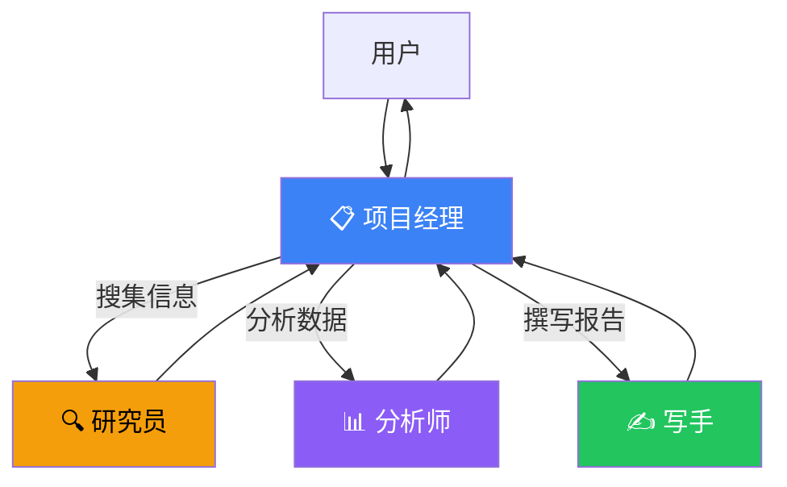

# 多 Agent 协作任务

## 目标

构建一个"AI 研究团队"——研究员搜集信息，分析师分析数据，写手生成报告，项目经理协调分工。

## 为什么要多 Agent？

单个 Agent 处理复杂任务容易"脑子不够用"。多 Agent 把任务拆开，每个 Agent 专注自己擅长的领域，效果更好。

类比：一个人不可能同时是研究员、分析师和作家。但一个团队可以。

## 协作流程



## 完整代码

```typescript
import { createAgent, createHandoff, tool } from "langchain";
import { z } from "zod";

// ① 搜索工具
const search = tool(
  async ({ query }) => {
    // 实际项目中接入搜索 API
    return `搜索"${query}"的结果：LangChain 是最流行的 Agent 框架，2024 年下载量增长 300%...`;
  },
  {
    name: "search",
    description: "搜索互联网获取信息",
    schema: z.object({ query: z.string() }),
  }
);

// ② 研究员 Agent：擅长搜集信息
const researcher = createAgent({
  model: "openai:gpt-4o",
  tools: [search],
  system: `你是研究专家。你的任务是：
1. 用搜索工具搜集信息
2. 整理成结构化的研究笔记
3. 标注信息来源`,
});

// ③ 分析师 Agent：擅长分析数据
const analyst = createAgent({
  model: "openai:gpt-4o",
  system: `你是数据分析专家。你的任务是：
1. 从研究笔记中提取关键数据
2. 发现趋势和规律
3. 给出数据驱动的结论`,
});

// ④ 写手 Agent：擅长写作
const writer = createAgent({
  model: "openai:gpt-4o",
  system: `你是专业写手。你的任务是：
1. 把分析结果写成通俗易懂的报告
2. 结构清晰：摘要、正文、结论
3. 语言简洁，适合非技术读者`,
});

// ⑤ 项目经理 Agent：负责路由和协调
const manager = createAgent({
  model: "openai:gpt-4o",
  handoffs: [
    createHandoff(researcher, {
      name: "researcher",
      description: "搜索和整理信息",
    }),
    createHandoff(analyst, {
      name: "analyst",
      description: "分析数据和趋势",
    }),
    createHandoff(writer, {
      name: "writer",
      description: "撰写最终报告",
    }),
  ],
  system: `你是项目经理，负责协调团队完成任务。

工作流程：
1. 先派 researcher 搜集信息
2. 拿到研究笔记后，派 analyst 分析
3. 拿到分析结果后，派 writer 撰写报告
4. 把最终报告返回给用户

你负责整体协调，不做具体工作。`,
});

// ⑥ 执行
async function main() {
  const result = await manager.invoke({
    messages: [{
      role: "user",
      content: "帮我研究 2024 年 AI Agent 的发展趋势，写一份 500 字的简报。",
    }],
  });

  console.log(result.messages.at(-1)?.content);
}

main();
```

## Handoff 机制

`createHandoff` 是 LangChain 提供的 Agent 间通信机制：

```typescript
createHandoff(targetAgent, {
  name: "agent名称",          // Manager 用这个名字来调用
  description: "这个 Agent 做什么",  // 帮 Manager 决定派给谁
});
```

## 扩展：并行执行

多个 Agent 可以同时工作，最后汇总：

```typescript
// 研究员和分析师可以并行
const [research, analysis] = await Promise.all([
  researcher.invoke({ messages: [{ role: "user", content: "搜集 AI Agent 趋势" }] }),
  analyst.invoke({ messages: [{ role: "user", content: "分析市场规模数据" }] }),
]);

// 写手基于两者结果撰写
const report = await writer.invoke({
  messages: [{ role: "user", content: `基于以下内容写报告：\n${research}\n${analysis}` }],
});
```

## 最佳实践

| 实践 | 说明 |
|------|------|
| 每个 Agent 职责单一 | 不要让研究员兼做分析，专注效果更好 |
| Manager 的 system prompt 要清晰 | 明确什么任务派给谁 |
| 控制 handoff 次数 | 太多来回会浪费 token |
| 用同一个模型或同系列 | 避免不同 Agent 风格差异太大 |

## 常见问题

| 问题 | 解答 |
|------|------|
| Manager 派错人了？ | 检查 handoff 的 description 是否清晰 |
| Agent 之间传递什么？ | 通常是文本消息，Manager 负责转发 |
| 能超过 3 个 Agent 吗？ | 能，但建议不超过 5 个，太多会难以管理 |
| 和 LangGraph 的区别？ | LangGraph 更底层，可以精细控制状态流转；Handoff 更简单快捷 |

## 下一步

- [搜索 Agent →](/tutorials/search-agent)
- [Multi-Agent 详解 →](/langchain/multi-agent)
- [LangGraph 编排 →](/langgraph/)
