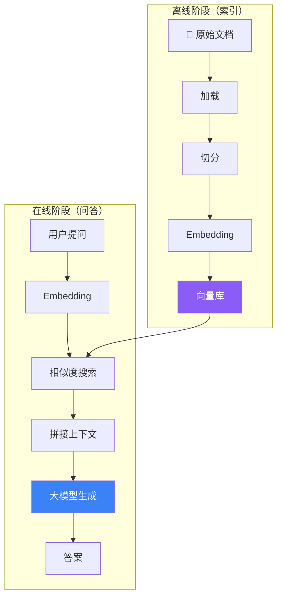

# 从零搭建 RAG 问答系统

## 目标

构建一个能从你的文档中回答问题的系统。不是让模型"凭记忆"回答，而是先从你的文档中找到相关内容，再基于这些内容生成答案。

## RAG 工作原理



类比：开卷考试（RAG）vs 闭卷考试（纯模型）。开卷考试的答案更有依据，不容易瞎编。

## 完整代码

```typescript
import { createAgent } from "langchain";
import { OpenAIEmbeddings } from "@langchain/openai";
import { MemoryVectorStore } from "langchain/vectorstores/memory";
import { RecursiveCharacterTextSplitter } from "langchain/text_splitter";
import { Document } from "@langchain/core/documents";

// ① 准备你的文档（实际项目中从文件加载）
const documents = [
  new Document({
    pageContent: "LangChain 是一个用于构建 LLM 应用的开源框架，提供模型集成、工具调用、链式编排等功能。",
    metadata: { source: "intro.md" },
  }),
  new Document({
    pageContent: "Deep Agents 是开箱即用的 Agent 框架，内置子 Agent、文件系统、沙箱和长期记忆。",
    metadata: { source: "deepagents.md" },
  }),
  new Document({
    pageContent: "LangGraph 是底层编排运行时，用状态图设计可靠的工作流，支持持久化和人工介入。",
    metadata: { source: "langgraph.md" },
  }),
];

// ② 切分文档（大文档需要切分，小文档可以跳过）
const splitter = new RecursiveCharacterTextSplitter({
  chunkSize: 500,
  chunkOverlap: 50,
});
const chunks = await splitter.splitDocuments(documents);
console.log(`切分为 ${chunks.length} 个块`);

// ③ 向量化并存入向量库
const embeddings = new OpenAIEmbeddings({ model: "text-embedding-3-small" });
const vectorStore = await MemoryVectorStore.fromDocuments(chunks, embeddings);

// ④ 创建 RAG Agent
const agent = createAgent({
  model: "openai:gpt-4o",
  retrieval: {
    vectorStore,
    topK: 3,  // 检索最相关的 3 个文档块
  },
  system: `你是一个技术文档问答助手。
规则：
1. 只根据检索到的资料回答
2. 如果资料中没有相关内容，明确说"我不知道"
3. 引用资料来源`,
});

// ⑤ 提问
const result = await agent.invoke({
  messages: [{ role: "user", content: "什么是 Deep Agents？它和 LangChain 有什么区别？" }],
});

console.log(result.messages.at(-1)?.content);
```

**预期输出：**
```
根据资料，Deep Agents 是开箱即用的 Agent 框架，内置子 Agent、文件系统、沙箱和长期记忆。
而 LangChain 是一个更底层的开源框架，提供模型集成、工具调用、链式编排等基础功能。
简单说，Deep Agents 是 LangChain 的"增强版"，在 LangChain 基础上增加了开箱即用的高级功能。
（来源：deepagents.md, intro.md）
```

## 从文件加载

实际项目中，文档通常来自文件：

```typescript
import { TextLoader } from "langchain/document_loaders/fs/text";
import { PDFLoader } from "@langchain/community/document_loaders/fs/pdf";
import { DirectoryLoader } from "langchain/document_loaders/fs/directory";

// 加载单个文件
const loader = new TextLoader("./docs/readme.txt");
const docs = await loader.load();

// 批量加载目录
const dirLoader = new DirectoryLoader("./docs", {
  ".txt": (path) => new TextLoader(path),
  ".pdf": (path) => new PDFLoader(path),
});
const allDocs = await dirLoader.load();
```

## 参数调优

| 参数 | 推荐值 | 说明 |
|------|--------|------|
| `chunkSize` | 500-1000 | 文档块大小 |
| `chunkOverlap` | 50-100 | 相邻块重叠 |
| `topK` | 3-5 | 检索文档数量 |
| Embedding 模型 | `text-embedding-3-small` | 性价比首选 |
| Chat 模型 | `gpt-4o` | 生成质量好 |

## 最佳实践

| 实践 | 说明 |
|------|------|
| System Prompt 要约束 | "只根据资料回答"可以减少幻觉 |
| topK 别太大 | 太多文档会引入噪声 |
| 保留 metadata | 返回答案时引用来源，增强可信度 |
| 定期更新向量库 | 文档变更后需要重新 embedding |

## 常见问题

| 问题 | 解答 |
|------|------|
| 回答不准确？ | 调整 chunkSize、换更好的 Embedding 模型、增加 topK |
| 中文效果差？ | 切分时加中文分隔符（`。` `；`），Embedding 用 `text-embedding-3-small` |
| 大文档处理慢？ | 用批量 embedding，考虑用持久化向量库（Pinecone、Qdrant） |

## 下一步

- [搜索 Agent →](/tutorials/search-agent)
- [RAG 详解 →](/langchain/retrieval)
- [向量库存储 →](/integrations/stores)
