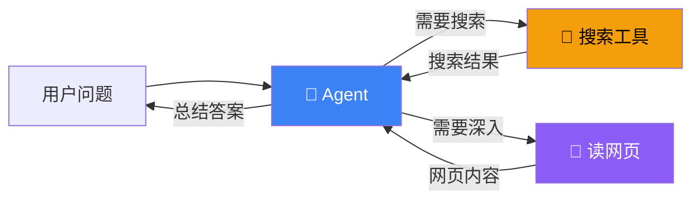

# 构建能搜索的 Agent

## 目标

构建一个不只是"聊天"的 Agent——它能主动搜索网页、阅读内容、总结答案。就像一个能上网冲浪的研究助手。

## 工作流程



## 完整代码

```typescript
import { createAgent, tool } from "langchain";
import { z } from "zod";

// ① 搜索工具
const search = tool(
  async ({ query }) => {
    // 实际项目中接入搜索 API（Google、Bing、SerpAPI 等）
    // 这里用模拟数据演示
    const mockResults: Record<string, string> = {
      "AI Agent": "2024 年 AI Agent 领域快速发展，LangChain、CrewAI、AutoGen 是三大主流框架。",
      "LangChain": "LangChain 是最流行的 Agent 开发框架，支持 TypeScript 和 Python。",
    };
    return mockResults[query] || `未找到"${query}"的相关结果`;
  },
  {
    name: "search",
    description: "搜索互联网获取最新信息。输入搜索关键词。",
    schema: z.object({
      query: z.string().describe("搜索关键词"),
    }),
  }
);

// ② 读网页工具
const fetchPage = tool(
  async ({ url }) => {
    try {
      const response = await fetch(url);
      const text = await response.text();
      // 截取前 2000 字符，避免超出上下文
      return text.slice(0, 2000);
    } catch (e) {
      return `无法访问 ${url}`;
    }
  },
  {
    name: "fetch_page",
    description: "获取网页内容。输入完整的 URL。",
    schema: z.object({
      url: z.string().describe("网页 URL"),
    }),
  }
);

// ③ 创建 Agent
const agent = createAgent({
  model: "openai:gpt-4o",
  tools: [search, fetchPage],
  system: `你是一个搜索研究助手。

工作流程：
1. 先用 search 工具搜索用户的问题
2. 如果搜索结果不够详细，用 fetch_page 工具读取相关网页
3. 综合所有信息，用简洁的语言总结答案
4. 注明信息来源

要求：
- 回答要基于搜索结果，不要凭记忆回答
- 如果搜索没有结果，明确告诉用户`,
});

// ④ 使用
async function main() {
  const result = await agent.invoke({
    messages: [{ role: "user", content: "2024 年最火的 AI Agent 框架有哪些？" }],
  });

  console.log(result.messages.at(-1)?.content);
}

main();
```

## 如何接入真实搜索 API

### SerpAPI

```typescript
const search = tool(
  async ({ query }) => {
    const response = await fetch(
      `https://serpapi.com/search.json?q=${encodeURIComponent(query)}&api_key=${process.env.SERPAPI_KEY}`
    );
    const data = await response.json();
    return data.organic_results
      .slice(0, 5)
      .map((r: any) => `${r.title}: ${r.snippet}`)
      .join("\n");
  },
  {
    name: "search",
    description: "搜索互联网",
    schema: z.object({ query: z.string() }),
  }
);
```

## Agent 决策过程

Agent 不是按固定流程执行，而是**自己决定**下一步做什么：

```
用户: 2024年最火的AI框架？
Agent 思考: 我需要搜索最新信息 → 调用 search("AI Agent 2024")
Agent 思考: 搜索结果有了一些信息，但不够详细 → 调用 fetch_page("https://...")
Agent 思考: 信息足够了 → 生成总结答案
```

## 最佳实践

| 实践 | 说明 |
|------|------|
| 工具 description 要详细 | Agent 靠描述决定是否调用 |
| 控制工具返回长度 | 网页内容截取前 2000 字符，避免撑爆上下文 |
| System Prompt 指定流程 | 告诉 Agent 先搜索再总结，减少无效调用 |
| 加错误处理 | 工具失败时返回有意义的错误信息 |

## 下一步

- [工具集成 →](/integrations/tools)
- [多 Agent 协作 →](/tutorials/multi-agent)
- [RAG 问答 →](/tutorials/rag-qa)
